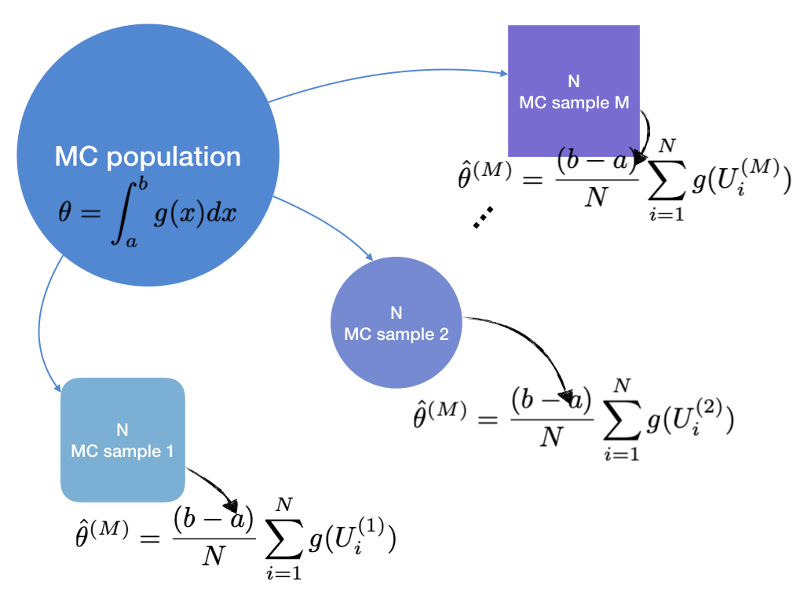

# Monte Carlo Integration and Variance Reduction {#mcint}

## Monte Carlo Integration

Consider integration problem of a integrable function $g(x)$. We want to compute

$$\theta \equiv \int_a^b g(x) dx$$

<!-- For instance, $g(x) = e^{x^2}$ -->

<!-- ```{example, mcex} -->
<!-- $$\int_0^1 e^{x^2} dx$$ -->
<!-- ``` -->

<!-- It seems tricky to compute the integral \@ref(exm:mcex) analytically even though possible. So we implement *simulation* concept here, based on the following theorems. -->

For instance, standard normal cdf.

```{example, mcex, name = "Standard normal cdf"}
Compute values for

$$\Phi(x) = \int_{-\infty}^x \frac{1}{\sqrt{2\pi}}\exp\bigg(-\frac{t^2}{2}\bigg)dt$$
```

It might be impossible to compute this integral with hand. So we implement *simulation* concept here, based on the following theorems.

```{theorem, wlaw, name = "Weak Law of Large Numbers"}
Suppose that $X_1, \ldots, X_n \iid (\mu, \sigma^2 < \infty)$. Then

$$\frac{1}{n}\sum_{i = 1}^n X_i \stackrel{p}{\rightarrow} \mu$$

Let $g$ be a measurable function. Then

$$\frac{1}{n}\sum_{i = 1}^n g(X_i) \stackrel{p}{\rightarrow} g(\mu)$$
```

```{theorem, slaw, name = "Strong Law of Large Numbers"}
Suppose that $X_1, \ldots, X_n \iid (\mu, \sigma^2 < \infty)$. Then

$$\frac{1}{n}\sum_{i = 1}^n X_i \stackrel{a.s.}{\rightarrow} \mu$$

Let $g$ be a measurable function. Then

$$\frac{1}{n}\sum_{i = 1}^n g(X_i) \stackrel{a.s.}{\rightarrow} g(\mu)$$
```

### Simple Monte Carlo estimator

```{theorem, mcint, name = "Monte Carlo Integration"}
Consider integration \@ref(eq:muint). This can be approximated via appropriate pdf $f(x)$ by

$$\hat\theta_M = \frac{1}{N} \sum_{i = 1}^N g(X_i)$$
```

Suppose that we have a distribution $f(x) = I_{spt g}(x)$, i.e. *uniform distribution*. Let $spt g = (a, b)$.

\begin{equation}
  \begin{split}
    \theta & \equiv \int_{spt g} g(x) dx \\
    & = \int_a^b g(x) dx \\
    & = \int_0^1 g(a + (b - a)t)(b - a) dt \\
    & \equiv \int_0^1 h(t) dt \\
    & = \int_0^1 h(t) I_{(a, b)}(t) dt \\
    & = E[h(U)] \qquad U \sim unif(0, 1)
  \end{split}
  (\#eq:muint)
\end{equation}

By *the Strong law of large numbers* \@ref(thm:slaw),

$$\frac{1}{n}\sum_{i = 1}^n h(U_i) \stackrel{a.s.}{\rightarrow} E\Big[h(U)\Big] = \theta$$

where $U \sim unif(0, 1)$. Thus, what we have to do here are two things.

1. representing $g$ as $h$.
2. generating lots of $U_i$

<!-- Go back to Example \@ref(exm:mcex). -->

<!-- ```{solution} -->
<!-- \begin{equation*} -->
<!--   \begin{split} -->
<!--     \theta & \equiv \int_0^1 e^{x^2} dx \\ -->
<!--     & = \int_0^1 \frac{e^{x^2}}{f(x)}f(x) dx \qquad f(x) = \frac{e^x}{e - 1} : pdf \\ -->
<!--     & = \int_0^1 (e - 1)\exp(x^2 - x)f(x)dx \\ -->
<!--     & \approx \frac{1}{M} \sum_{m = 1}^M (e - 1)\exp(X_m^2 - X_m) -->
<!--   \end{split} -->
<!-- \end{equation*} -->

<!-- Then generate $X_1, \ldots, X_M \sim f(x)$. -->

<!-- Let $F(X_1), \ldots, F(X_M) \iid unif(0, 1)$ where -->

<!-- $$F(x) = \int_0^x f(t)dt = \frac{e^x - 1}{e - 1}$$ -->

<!-- i.e. $U_1 = \frac{e^{X_1} - 1}{e - 1}, \ldots, U_M = \frac{e^{X_M} - 1}{e - 1} \iid unif(0, 1)$. Hence, -->

<!-- $$X_m = \ln (1 + (e - 1) U_m)$$ -->
<!-- ``` -->

<!-- i.e. -->

<!-- 1. $u_1, \ldots, u_M \iid unif(0,1)$ -->
<!-- 2. $x_i = \ln (1 + (e - 1) u_i)$ -->

<!-- ```{r} -->
<!-- x <- log(1 + (exp(1) - 1) * runif(10000)) -->
<!-- mean((exp(1) - 1) * exp(x^2 - x)) -->
<!-- ``` -->

<!-- This method is also helpful solving high-dimensional problem. -->

<!-- ```{example, mcex2, name = "Higher dimensional problem"} -->
<!-- $$\int_0^1 \int_0^1 e^{(x_1 + x_2)^2} dx_1 dx_2$$ -->
<!-- ``` -->

<!-- ```{solution} -->
<!-- \begin{equation*} -->
<!--   \begin{split} -->
<!--     I & \equiv \int_0^1 \int_0^1 e^{(x_1 + x_2)^2} dx_1 dx_2 \\ -->
<!--     & = \int_0^1\int_0^1 \frac{e^{(x_1 + x_2)^2}}{f(x_1, x_2)}f(x_1, x_2) dx_1dx_2 \qquad f(x) = \frac{e^{(x_1 + x_2)}}{(e - 1)^2} = \frac{e^{x_1}}{e - 1} + \frac{e^{x_2}}{e - 1} \\ -->
<!--     & = \int_0^1\int_0^1 (e - 1)^2\exp((x_1 + x_2)^2 - x_1 - x_2)f(x_1, x_2)dx_1dx_2 \\ -->
<!--     & \approx \frac{1}{M} \sum_{m = 1}^M (e - 1)^2\exp((X_{1m} + X_{2m})^2 - X_{1m} - X_{2m}) -->
<!--   \end{split} -->
<!-- \end{equation*} -->
<!-- ``` -->

<!-- Hence, -->

<!-- 1. $u_{1m}, u_{2m} \sim unif(0,1), \quad m = 1, \ldots, M$ -->
<!-- 2. $x_{jm} = \ln(1 + (e - 1)u_{jm}), \quad j = 1, 2, \quad m = 1, \ldots, M$ -->

<!-- ```{r} -->
<!-- tibble( -->
<!--   x1 = log(1 + (exp(1) - 1) * runif(10000)), -->
<!--   x2 = log(1 + (exp(1) - 1) * runif(10000)) -->
<!-- ) %>%  -->
<!--   summarise(int = mean((exp(1) - 1)^2 * exp((x1 + x2)^2 - x1 - x2))) -->
<!-- ``` -->

Go back to Example \@ref(exm:mcex).


```{solution}
Case 1: $x > 0$

Since $\Phi(x)$ is symmetry,

$$\Phi(0) = \frac{1}{2}$$

Fix $x > 0$.

\begin{equation*}
  \begin{split}
    \int_0^x \exp\bigg(-\frac{t^2}{2}\bigg) dt & = \int_0^x x\exp\bigg(-\frac{t^2}{2}\bigg)\frac{I_{(0, x)}(t)}{x} dt \\
    & \approx \frac{1}{N} \sum_{i = 1}^N x\exp\bigg(-\frac{U_i^2}{2}\bigg)
  \end{split}
\end{equation*}

with $U_1, \ldots, U_N \iid unif(0, x)$.

Case 2: $x \le 0$

Recall that $\Phi(x)$ is symmetry.

Hence,

$$
\hat\Phi(x) = \begin{cases}
  \frac{1}{\sqrt{2\pi}} \frac{1}{N} \sum_{i = 1}^N x\exp\bigg(-\frac{U_i^2}{2}\bigg) + \frac{1}{2} \equiv \hat\theta(x) & x \ge 0 \\
  1 - \hat\theta(-x) & x < 0
\end{cases}
$$
```

```{r}
phihat <- function(x, y) {
  yi <- abs(y)
  theta <- mean(yi * exp(-x^2 / 2)) / sqrt(2 * pi) + .5
  ifelse(y >= 0, theta, 1 - theta)
}
```

Then compute $\hat\Phi(x)$ for various $x$ values.

```{r}
phi_simul <- foreach(y = seq(.1, 2.5, length.out = 10), .combine = bind_rows) %do% {
  tibble(
    x = y,
    phi = pnorm(y),
    Phihat = 
      tibble(x = runif(10000, max = y)) %>% 
      summarise(cdf = phihat(x, y = y)) %>% 
      pull()
  )
}
```

```{r, echo=FALSE}
knitr::kable(phi_simul, col.names = c("x", "pnorm", "mc"), caption = "Simple MC estimates of Normal cdf for each x", longtable = TRUE)
```


### Hit-or-Miss Monte Carlo

Hit-or-Miss approach is another way to evaluate integrals.

```{example, estpi, name = "Estimation of $\\pi$"}
Consider a circle in $\R$ coordinate.

$$x^2 + y^2 = 1$$

Since $y = \sqrt{1 - x^2}$,

\begin{equation}
  \int_0^1 \sqrt{1 - t^2} dt = \frac{\pi}{4}
  (\#eq:mcpi)
\end{equation}
```

By estimating Equation \@ref(eq:mcpi), we can estimate $\pi$, i.e.

$$\pi = 4 \int_0^1 \sqrt{1 - t^2} dt$$

Simple MC integration can also be used.

\begin{equation*}
  \begin{split}
    \int_0^1 \sqrt{1 - t^2} dt & = \int_0^1 \sqrt{1 - t^2} I_{(0,1)}(t) dt \\
    & \approx \frac{1}{N} \sum_{i = 1}^N \sqrt{1 - U_i^2}
  \end{split}
\end{equation*}

```{r}
circ <- function(x) {
  4 * sqrt(1 - x^2)
}
```

```{r}
tibble(x = runif(10000)) %>% 
  summarise(mc_pi = mean(circ(x)))
```


On the other way, hit-or-miss MC method applies geometric probability.

```{r hmmc, echo=FALSE, fig.cap="Hit-or-Miss"}
tibble(x = seq(0, 1, by = .01)) %>% 
  mutate(y = sqrt(1 - x^2)) %>% 
  ggplot(aes(x, y)) +
  geom_path() +
  geom_ribbon(aes(ymin = 0, ymax = 1), alpha = .3) +
  geom_area(fill = gg_hcl(1), alpha = .5)
```

See Figure \@ref(fig:hmmc). From each coordinate, generate

- $X_i \iid unif(0,1)$
- $Y_i \iid unif(0,1)$

Then the proportion of $Y_i \le \sqrt{1 - X_i^2}$ estimates $\frac{\pi}{4}$.

```{r}
tibble(x = runif(10000), y = runif(10000)) %>% 
  summarise(hitormiss = mean(y <= sqrt(1 - x^2)) * 4)
```


## Variance and Efficiency

We have seen two apporoaches doing the same task. Now we want to *evaluate them*. Denote that simple Monte Carlo integration \@ref(thm:mcint) is estimating the *expected value of some random variable*. Proportion, which approximates probability is expected value of identity function.

The common statistic that can evaluate estimators expected value might be their variances.

### Variance

Note that variance of sample mean is $Var(\overline{g(X)}) = \frac{Var(g(X))}{N}$. This property is one of estimating variance of $\hat\theta$.

\begin{equation}
  \widehat{Var}(\hat\theta) = \frac{1}{N}\bigg( \frac{1}{N} \sum_{i = 1}^N (g(X_i) - \overline{g(X_i)}) \bigg) = \frac{1}{N^2} \sum_{i = 1}^N (g(X_i) - \overline{g(X_i)})
  (\#eq:mcsamvar)
\end{equation}

For example,

```{r}
tibble(x = runif(10000)) %>% 
  summarise(mc_pi = var(circ(x)) / 10000)
```

However, this *variance of sample mean* is used in situation when we are in sample limitation situation. We do not have to stick to this. Now, Generating samples as many as we want is possible. So we try another approach: *parametric bootstrap*.

```{r mcintvar, echo=FALSE, fig.cap="Empircal distribution of $\\hat\\theta$"}

```

See Figure \@ref(fig:mcintvar). If we estimate $E\Big[g(U \sim unif(a, b))\Big]$, we can get $\theta$. Generate $M$ samples $\{ U_1^{(j)}, \ldots, U_N^{(j)} \}, j = 1, \ldots M$ from this $U \sim unif(a, b)$. In each sample, calculate MC estimates $\hat\theta^{(j)}$. Now we have $M$ MC estimates $\hat\theta$. This gives empirical distribution of $\hat\theta$. By *drawing a histogram*, we can see the outline.

\begin{algorithm}[H] \label{alg:algmcint}
  \SetAlgoLined
  \SetKwInOut{Input}{input}
  \SetKwInOut{Output}{output}
  \Input{$\theta = \int_a^b g(x) dx$}
  \For{$m \leftarrow 1$ \KwTo $M$}{
    Generate $U_1^{(m)}, \ldots, U_N^{(m)} \iid unif(a, b)$ \;
    Compute $\hat\theta^{(j)} = \frac{(b - a)}{N} \sum g(U_i^{(j)})$\;
  }
  $\bar{\hat\theta} = \frac{1}{M} \sum \hat\theta^{(j)}$\;
  $\widehat{Var}(\hat\theta) = \frac{1}{M - 1} \sum (\hat\theta^{(j)} - \bar{\hat\theta})^2$\;
  \Output{$\widehat{Var}(\hat\theta)$}
  \caption{Variance of $\hat\theta$}
\end{algorithm}

Since we have to generate large size of data, `data.table` package will be used.

```{r, eval=FALSE}
library(data.table)
```

Group operation can be used. Additional column (`sam`) would indicate group, and for each group MC operation would be processed. The following is the function generating `data.table` before group operation.

```{r}
mc_data <- function(rand, N = 10000, M = 1000, char = "s", ...) {
  data.table(
    u = rand(n = N * M, ...),
    sam = gl(M, N, labels = paste0("s", 1:M))
  )
}
```


```{r}
pi_mc <-
  mc_data(runif)[,
                 .(mc_pi = mean(circ(u))),
                 keyby = sam]
```


```{r smchis, fig.cap="Empirical distribution of $\\hat\\pi$ by simple MC"}
pi_mc %>% 
  ggplot(aes(x = mc_pi)) +
  geom_histogram(bins = 30, col = gg_hcl(1), alpha = .7) +
  xlab(expression(pi)) +
  geom_vline(xintercept = pi, col = gg_hcl(2)[2])
```

As in Algorighm $\ref{alg:algmcint}$, we can compute the variance as below.

```{r}
(mc_var <-
  pi_mc[,
        .(mc_variance = var(mc_pi))])
```

On the other hand, we need to generate two sets of random numbers for hit-or-miss MC.

```{r}
pi_hit <-
  mc_data(runif)[
    , u2 := runif(10000 * 1000)
  ][,
    .(hitormiss = mean(u2 <= sqrt(1 - u^2)) * 4),
    keyby = sam]
```

```{r simhit, fig.cap="Simple MC and Hit-or-Miss MC"}
pi_mc[pi_hit] %>% 
  melt(id.vars = "sam", variable.name = "hat") %>% 
  ggplot(aes(x = value, fill = hat)) +
  geom_histogram(bins = 30, alpha = .5, position = "identity") +
  xlab(expression(pi)) +
  geom_vline(xintercept = pi, col = I("red")) +
  scale_fill_discrete(
    name = "MC",
    labels = c("Simple", "Hit-or-Miss")
  )
```

```{r}
(hit_var <-
  pi_hit[,
         .(hit_variance = var(hitormiss))])
```

### Efficiency

See Figure \@ref(fig:simhit). It is obvious that Hit-or-Miss estimate produces larger variance than simple MC.

```{definition, eff, name = "Efficiency"}
Let $\hat\theta_1$ and $\hat\theta_2$ be two estimators for $\theta$. Then $\hat\theta_1$ is more efficient than $\hat\theta_2$ if

$$\frac{Var(\hat\theta_1)}{Var(\hat\theta_2)} < 1$$
```

In other words, if $\hat\theta_1$ has smaller variance than $\hat\theta_2$, then $\hat\theta_1$ is said to be efficient, which is preferable.

```{r, echo=FALSE}
mc_var %>% 
  bind_cols(hit_var) %>% 
  mutate(mc_efficient = (mc_variance / hit_variance < 1)) %>% 
  knitr::kable(
    col.names = c("SimpleMC", "Hit-or-Miss", "SimpleMCefficiency"),
    caption = "Simple MC versus Hit-or-Miss",
    longtable = TRUE
  )
```


## Variance Reduction

Consider Equation \@ref(eq:mcsamvar) based on $Var(\hat\theta) = \frac{\sigma^2}{N}$. This variance can always reduced by adding $N$. But we want to reduce variance less computationally.

### Antithetic Variables

Consider correlated random variables $U_1$ and $U_2$. Then we have

$$Var\bigg( \frac{U_1 + U_2}{2} \bigg) = \frac{1}{4}\Big( Var(U_1) +  Var(U_2) + 2Cov(U_1, U_2)\Big)$$

See the last term $Cov(U_1, U_2)$. If we generate $U_{i1}$ and $U_{i2}$ negatively correlated, we can get reduced variance than previous i.i.d. sample

$$Var\bigg( \frac{U_1 + U_2}{2} \bigg) = \frac{1}{4}\Big( Var(U_1) +  Var(U_2)\Big)$$

```{lemma, antiunif}
$U$ and $1 - U$ are identically distributed, but *negatively correlated*.

\begin{enumerate}
  \item $U \sim unif(0,1) \Leftrightarrow 1 - U \sim unif(0,1)$
  \item $Corr(U, 1 - U) = -1$
\end{enumerate}
```

This is well-known property of uniform distribution. Instead of generating $N$ uniform numbers, try $\frac{N}{2}$ $U_i$ and make corresponding $\frac{N}{2}$ $1 - U_i$. This sequence becomes negatively correlated, so we can reduce the variance as mentioned.

When can we replace previous numbers with these *antithetic variables*? We usually plug-in the numbers in some function $h$ to get Monte carlo integration. The thing is, our target is $h$, not $U$. $h(U)$ and $h(1 - U)$ should *still be negatively correlated*. Hence, $h$ should be *monotonic function*.

```{corollary, antifun}
If $g = g(X_1, \ldots, X_n)$ is monotone, then

$$Y = g(F_X^{-1}(U_1), \ldots, F_X^{-1}(U_n))$$

and

$$Y^{\prime} = g(F_X^{-1}(1 - U_1), \ldots, F_X^{-1}(1 - U_n))$$

are negatively correlated.
```

\begin{algorithm}[H] \label{alg:alganti}
  \SetAlgoLined
  \SetKwInOut{Input}{input}
  \SetKwInOut{Output}{output}
  \Input{$h: monotonic$}
  \For{$m \leftarrow 1$ \KwTo $M$}{
    Generate $U_{1,1}^{(m)}, \ldots, U_{\frac{N}{2},1}^{(m)} \iid unif(0, 1)$\;
    Set $U_{i,2}^{(m)} := 1 - U_{i,1}^{(m)} \iid unif(0, 1)$\;
    $\{U_{i}^{(m)}\}_1^N = \{ U_{1,1}^{(m)}, \ldots, U_{{\frac{N}{2}},2}^{(m)} \}$\;
    $\hat\theta^{(j)} = \frac{1}{N} \sum h(U_i^{(j)})$\;
  }
  $\bar{\hat\theta} = \frac{1}{M} \sum \hat\theta^{(j)}$\;
  $\widehat{Var}(\hat\theta) = \frac{1}{M - 1} \sum (\hat\theta^{(j)} - \bar{\hat\theta})^2$\;
  \Output{$\widehat{Var}(\hat\theta)$}
  \caption{Variance of $\hat\theta$ using antithetic variables}
\end{algorithm}

Check again Example \@ref(exm:mcex). We have try to calculate

$$\Phi(x) = \int_{-\infty}^x \frac{1}{\sqrt{2\pi}}\exp\bigg(-\frac{t^2}{2}\bigg)dt$$

using simple monte carlo. To make the support $(0, 1)$, let $y = \frac{t}{x}$ be a change of variable. Then

\begin{equation*}
  \begin{split}
    \int_0^x \exp\bigg(-\frac{t^2}{2}\bigg) dt & = \int_0^1 x\exp\bigg(-\frac{(xy)^2}{2}\bigg) dy \\
    & \approx \frac{1}{N} \sum_{i = 1}^N x\exp\bigg(-\frac{(xU_i)^2}{2}\bigg)
  \end{split}
\end{equation*}

```{r}
phiunif <- function(x, y) {
  yi <- abs(y)
  theta <- mean(yi * exp(-(yi * x)^2 / 2)) / sqrt(2 * pi) + .5
  ifelse(y >= 0, theta, 1 - theta)
}
```

Consider $\Phi(2)$.

```{r}
phi2 <-
  mc_data(runif)[,
                 .(p2 = phiunif(u, y = 2)),
                 keyby = sam]
```

Now apply antithetic variables.

```{r}
phi2_anti <-
  mc_data(runif, N = 10000 / 2)[,
                                u2 := 1 - u] %>% 
  melt(id.vars = "sam", value.name = "U") %>% 
  .[,
    .(anti_p2 = phiunif(U, y = 2)),
    keyby = sam]
```

```{r svsanti, fig.cap="Use of antithetic variables"}
phi2[phi2_anti] %>% 
  melt(id.vars = "sam", variable.name = "hat") %>% 
  ggplot(aes(x = value, fill = hat)) +
  geom_histogram(bins = 30, alpha = .5, position = "identity") +
  xlab(expression(pi)) +
  geom_vline(xintercept = pnorm(2), col = I("red")) +
  scale_fill_discrete(
    name = "MC",
    labels = c("Simple", "Antithetic")
  )
```

Obviously, variance has been reduced.

```{r}
phi2[phi2_anti] %>% 
  melt(id.vars = "sam", variable.name = "hat") %>% 
  .[,
    .(variance = var(value)),
    by = hat]
```

### Control Variates

Recall that we are trying to estimate $\theta = EX$ here in MC integration. Consider other output random variable. Suppose that $\mu_Y \equiv E(Y)$ is known. Then

$$X + c(Y - \mu_Y)$$

is an unbiased estimator for $\theta$ for any $c \in \R$.


## Importance Sampling


