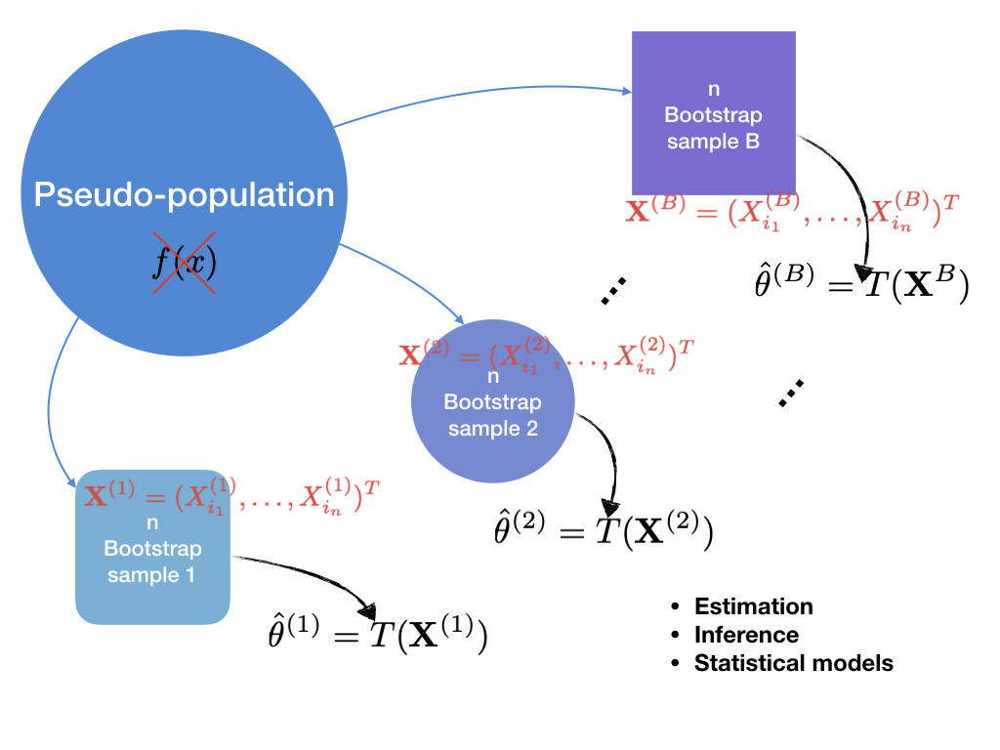
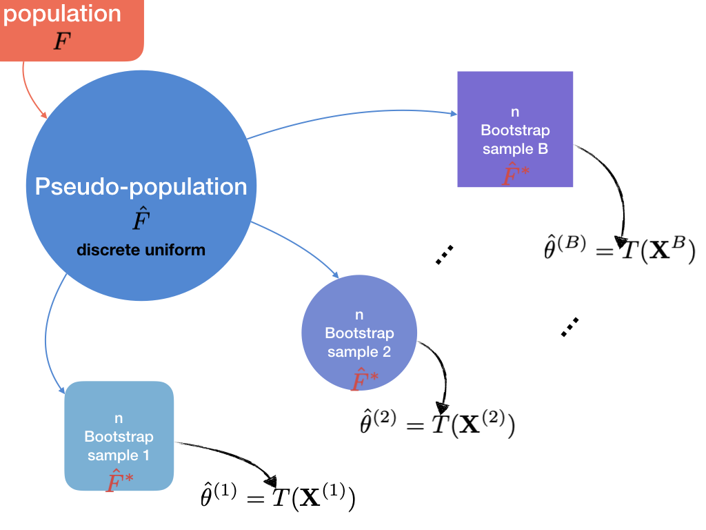
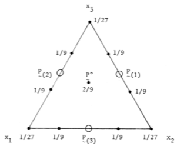

# Monte Carlo Methods in Inference

## Parametric Bootstrap

In this setting, we know distribution of $X$. We can freely generate from this distribution.

```{r paramboot, echo=FALSE, fig.cap="Parametric bootstrap"}

```

See Figure \@ref(fig:paramboot). From the "true" distribution, we can generate multiple samples. From each sample estimator can be computed. Then we can check these multiple estimates. Multiple estimates are close to motivation of estimator, so it helps exploring statistical inference with simple steps.

```{r}
mc_data <- function(rand, N = 10000, M = 1000, char = "s", ...) {
  data.table(
    x = rand(n = N * M, ...),
    sam = gl(M, N, labels = paste0("s", 1:M))
  )
}
```

## Monte Carlo Methods for Estimation

```{example, quanint, name = "Any quantity of interest"}
Suppose that $X_1, X_2 \iid N(0, 1)$. We want to estimate

$$\theta = E\lvert X_1 - X_2 \rvert$$
```

### Empirical distribution

\begin{algorithm}[H] \label{alg:algx1x2}
  \SetAlgoLined
  \SetKwInOut{Input}{input}
  \SetKwInOut{Output}{output}
  \Input{distribution $f$}
  \For{$m \leftarrow 1$ \KwTo $M$}{
    Generate $(X_1^{(m)}, X_2^{(m)}) \iid N(0, 1)$\;
    Compute $\hat\theta^{(m)} = \lvert X_1^{(m)} - X_2^{(m)} \rvert$\;
  }
  Draw a histogram\;
  \Output{$\bar{\hat\theta} = \frac{1}{M} \sum\limits_{m = 1}^M\hat\theta_m^{(m)}, \{ \hat\theta^{(1)}, \ldots, \hat\theta^{(M)} \}$}
  \caption{Empirical distribution of $\hat\theta$}
\end{algorithm}

```{r}
basicmc <-
  mc_data(rnorm, N = 2)[,
                        xname := gl(2, 1, length = 2000, labels = c("x1", "x2"))] %>% 
  dcast(sam ~ xname, value.var = "x") %>% 
  .[,
    .(that = mean(abs(x1 - x2))),
    by = sam]
```

```{r}
basicmc[,
        .(est = mean(that))]
```

```{r absx12, fig.cap="Empirical distribution of $\\hat\\theta$ for $\\lvert X_1 - X_2 \\rvert$"}
basicmc %>% 
  ggplot(aes(x = that)) +
  geom_histogram(bins = 30, col = gg_hcl(1), alpha = .7) +
  xlab(expression(theta))
```

### Standard error

In Algorithm $\ref{alg:algx1x2}$, we can get standard error by just calculating standard deviation of

$$\{ \hat\theta^{(1)}, \ldots, \hat\theta^{(M)} \}$$

\begin{algorithm}[H] \label{alg:algmcse}
  \SetAlgoLined
  \SetKwInOut{Input}{input}
  \SetKwInOut{Output}{output}
  \Input{distribution $f$}
  \For{$m \leftarrow 1$ \KwTo $M$}{
    Generate $(X_1^{(m)}, X_2^{(m)}) \iid N(0, 1)$\;
    Compute $\hat\theta^{(m)} = \lvert X_1^{(m)} - X_2^{(m)} \rvert$\;
  }
  $\bar{\hat\theta} = \frac{1}{M} \sum\limits_{m = 1}^M\hat\theta_m^{(m)}$\;
  $\widehat{SE}(\hat\theta) = \sqrt{\frac{1}{M - 1}\sum\limits_{m = 1}^M(\hat\theta^{(m)} - \bar{\hat\theta})}$\;
  \Output{$\widehat{SE}(\hat\theta)$}
  \caption{Standard error of $\hat\theta$}
\end{algorithm}

```{r}
basicmc[,
        .(se = sd(that))]
```

### Mean squared error

$MSE$ is used when comparing several estimators.

```{definition, mse, name = "Mean squared error"}
$$MSE(\hat\theta) := E(\hat\theta - \theta)^2$$
```

To know $MSE$, however, we should compute expectation. Some of them might be complicated even though we know true distribution. As the last chapter, we can apply Monte carlo method.

```{example, trim, name = "MSE of a trimmed mean"}
Suppose that $X_1, \ldots, X_n \iid N(2, 1)$. Consider three estimators for $\mu = 2$.

\begin{enumerate}
  \item mean $\overline{X}$
  \item median $\tilde{X}$
  \item $k$th trimmed mean $\overline{X}_{[-k]}$
\end{enumerate}
```

\begin{algorithm}[H] \label{alg:algmse}
  \SetAlgoLined
  \SetKwInOut{Input}{input}
  \SetKwInOut{Output}{output}
  \Input{distribution $f$}
  \For{$m \leftarrow 1$ \KwTo $M$}{
    Generate $(X_1^{(m)}, \ldots, X_N^{(m)}) \iid N(2, 1)$\;
    Sort $(X_1^{(m)}, \ldots, X_N^{(m)})$ in increasing order, i.e. $(X_{(1)}^{(m)}, \ldots, X_{(N)}^{(m)})$\;
    Mean $\overline{X}^{(m)} = \frac{1}{N}\sum\limits_{i = 1}^N X_i^{(m)}$\;
    Median $\tilde{X}^{(m)} = \begin{cases} X_{\frac{N}{2} + 1}^{(m)} & N \:\text{odd} \\ \frac{X_{\frac{N}{2}}^{(m)} + X_{\frac{N}{2} + 1}^{(m)}}{2} & N \:\text{even} \end{cases}$\;
    $k$th trimmed mean $\overline{X}_{[-k]}^{(m)} = \frac{1}{N - 2k}\sum\limits_{i = k + 1}^{n - k}X_{(i)}^{(m)}$
  }
  $\widehat{MSE}(\overline{X}) = \frac{1}{M} \sum\limits_{m = 1}^M (\overline{X}^{(m)} - 2)^2$\;
  $\widehat{MSE}(\tilde{X}) = \frac{1}{M} \sum\limits_{m = 1}^M (\tilde{X}^{(m)} - 2)^2$\;
  $\widehat{MSE}(\overline{X}_{[-k]}) = \frac{1}{M} \sum\limits_{m = 1}^M (\overline{X}_{[-k]}^{(m)} - 2)^2$\;
  \Output{$\widehat{MSE}(\overline{X}), \widehat{MSE}(\tilde{X}), \:\text{and}\: \widehat{MSE}(\overline{X}_{[-k]})$}
  \caption{MSE of mean, median, and $k$th trimmed mean}
\end{algorithm}

```{r}
trim <- function(x, k = 1) {
  n <- length(x)
  x <- sort(x)
  sum(x[(k + 1):(n - k)]) / (n - 2 * k)
}
#--------------------------------------
mu_list <- function(x, k) {
  list(mean = mean(x), median = median(x), trim = trim(x, k))
}
```

Try $k = 1$.

```{r}
(trim_mc <-
  mc_data(rnorm, mean = 2, sd = 1)[,
                                   unlist(lapply(.SD, mu_list, k = 1)) %>% as.list,
                                   by = sam])
```

```{r meanemp, fig.cap="Empirical distribution of each estimator for $\\mu = 2$"}
trim_mc %>% 
  melt(id.vars = "sam", variable.name = "hat") %>% 
  ggplot(aes(x = value, fill = hat)) +
  geom_histogram(bins = 30, alpha = .3, position = "identity") +
  xlab(expression(mu)) +
  geom_vline(xintercept = 2, col = I("red")) +
  scale_fill_discrete(
    name = "Estimates",
    labels = c("Mean", "Median", "Trimmed")
  )
```

Here, median shows the largest standard error.

```{r}
trim_mc[,
        lapply(.SD, sd),
        .SDcols = -"sam"]
```

Now try various $k$ for trimmed mean.

```{r}
mse_list <- function(x, k) {
  list(mse = mean((x - 2)^2), se = sd(x))
}
#-----------------------------------------
trim_mse <-
  mc_data(rnorm, mean = 2, sd = 1)[,
                                   lapply(.SD, function(x) {
                                     sapply(0:9, function(k) {
                                       trim(x = x, k = k)
                                     })
                                   }) %>% 
                                     unlist() %>% 
                                     as.list(),
                                   by = sam][,
                                             lapply(.SD, mse_list) %>% 
                                               unlist() %>% 
                                               as.list(),
                                             .SDcols = -"sam"]
```

```{r}
trim_mse %>% 
  transpose() %>% 
  .[,
    `:=`(
      k = rep(0:9, each = 2),
      hat = gl(2, k = 1, length = 2 * 10, labels = c("mse", "se"))
    )] %>% 
  dcast(k ~ hat, value.var = "V1")
```

## Confidence interval

Remember the meaning of 95% confidence interval. *If we have 100 samples and construct confidence interval in each sample, 95 intervals would include true parameter*. In this Monte Carlo setting, we know true population distribution, so we can generate multiple samples. Thus, we can reproduce this confidence interval situation.

### Empirical confidence interval

See one of histograms of Figure \@ref(fig:meanemp). Estimates are sorted. Calculating the upper and lower quantiles would give values close to confidence interval. See Figure \@ref(fig:absx12). While the former show symmetric distribution, this is not. 0.25 and 0.975 quantile might be inappropriate. In this case, we should pick the *shortest interval with 95%*. Best critical region leads to the shortest length of CI given $\alpha$, so we are finding this one.

\begin{algorithm}[H] \label{alg:algempci}
  \SetAlgoLined
  \SetKwInOut{Input}{input}
  \SetKwInOut{Output}{output}
  \Input{distribution $f$}
  \For{$m \leftarrow 1$ \KwTo $M$}{
    Generate $X_1^{(m)}, \ldots, X_n^{(m)} \iid f$\;
    Compute $\hat\theta^{(m)} = \hat\theta(\mathbf{\mathbf{X}^{(m)}})$\;
  }
  \eIf{Distribution of $\{ \hat\theta^{(m)} \}_1^M$ symmetric}{
    Sort $\{ \hat\theta^{(1)}, \ldots, \hat\theta^{(M)} \}$ in decreasing order, i.e. $\{ \hat\theta_{(1)}^{(1)}, \ldots, \hat\theta_{(M)}^{(M)} \}$\;
    Compute $LB= \frac{\alpha}{2} \:\text{sample quantile}$ and $UB= 1 - \frac{\alpha}{2} \:\text{sample quantile}$\;
  }{
    \ForEach{$lb < 0.05$ with $ub - lb = 1 - \alpha$}{
      Candidate interval $(lb, ub)$\;
      calculate length $l_i = ub - lb$\;
    }
    $(LB, UB)$: pick up the interval with the smallest length $l_i$\;
  }
  \Output{$(LB, UB)$}
  \caption{Empirical confidence interval by Monte Carlo method}
\end{algorithm}

### Empirical confidence level

On the contrary, we can estiamte confidence level given confidence interval.

```{example, civar, name = "Confidence interval for variance"}
If $X_1, \ldots, X_n \iid N(\mu, \sigma^2)$, then

$$T = \frac{(n - 1)S^2}{\sigma^2} \sim \chi^2(n - 1)$$

Thus, $100(1 - \alpha)\%$ confidence interval is given by

$$(0, \frac{(n -1)S^2}{\chi^2_{\alpha}(n - 1)})$$
```

For each MC sample, compute confidence interval. Just check if *known true parameter* is in the interval. Its proportion becomes the confidence level. It is simpler that estimate confidence interval itself.

\begin{algorithm}[H] \label{alg:algcilev}
  \SetAlgoLined
  \SetKwInOut{Input}{input}
  \SetKwInOut{Output}{output}
  \Input{distribution $f$ with parameter $\theta$}
  \For{$m \leftarrow 1$ \KwTo $M$}{
    Generate $X_1^{(m)}, \ldots, X_n^{(m)} \iid f$\;
    Compute the confidence interval $C_m$\;
    Compute $Y_j = I(\theta \in C_m)$, i.e. whether $\theta$ is in the CI\;
  }
  Empirical confidence level $\overline{Y} = \sum\limits_{m = 1}^M Y_m$\; \label{alg:cilevlast}
  \Output{$\overline{Y}$}
  \caption{Empirical confidence level by Monte Carlo method}
\end{algorithm}

Let $\mu = 0$, $\sigma = 2$, $N = 20$, and let $M = 1000$.

```{r}
ci_var <- function(x, variance, alpha) {
  n <- length(x)
  s2 <- var(x)
  (n - 1) * s2 / qchisq(alpha, df = n - 1) > variance
}
#---------------------------
ci_lev <-
  mc_data(rnorm, N = 20, M = 1000, mean = 0, sd = 2)[,
                                                     .(hat = mean(ci_var(x, variance = 4, alpha = .05))),
                                                     by = sam]
```


```{r ciin, fig.cap="Proportion of $\\sigma^2$ in confidence intervals"}
ci_lev[,
       .N,
       by = hat][,
                 proportion := N / sum(N)] %>%
  ggplot(aes(x = hat, y = proportion, fill = factor(hat))) +
  geom_bar(stat = "identity") +
  scale_fill_discrete(
    name = "CI",
    labels = c("out", "in")
  ) +
  xlab(expression(y))
```

This leads to empirical confidence level, i.e. *sample proportion*. Just follow the last step $\ref{alg:cilevlast}$ of Algorithm $\ref{alg:algcilev}$.

```{r}
(ci_lev <-
  ci_lev[,
         .(level = mean(hat))])
```

It is very close to $0.95$. One of advantages of simulation study is we can assume various situation. For example, *violation of Gausiannity*.

```{example, nonnormal, name = "Violation of Normal distribution assumption"}
Refer to Example \@ref(exm:civar). This has assumed that $X_i \iid N(\mu = 2, \sigma^2 = 4)$. What if not? For instance,

$$X_1, \ldots, X_n \iid \chi^2(df = 2)$$
```

Just change random numbers.

```{r}
ci_lev2 <-
  mc_data(rchisq, N = 20, M = 1000, df = 2)[,
                                            .(hat = mean(ci_var(x, variance = 4, alpha = .05))),
                                            by = sam][,
                                                      .(non_normal = mean(hat))]
```

```{r emlevpop, echo=FALSE}
cbind(ci_lev, ci_lev2) %>% 
  knitr::kable(col.names = c("Normal", "Chisq"), caption = "Empirical confidence level for each population", longtable = TRUE)
```

From Table \@ref(tab:emlevpop), we found that *non-normality lowers confidence level* from `r as.numeric(ci_lev)` to `r as.numeric(ci_lev2)`.

## Hypothesis tests

Using MC method, we have done point estimation and interval estimation. Now consider *hypothesis testing*.

$$H_0: \theta \in \Theta_0 \qquad \text{vs} \qquad H_1: \theta \in \Theta_1$$

where $\{ \Theta_0, \Theta_1 \}$ is a partition of the parameter space $\Theta$. First of all, we have *test statistic*

$$T(\mathbf{X}) \hsim f$$

and $f$ is called *null distribution*. Given observed data, we compute this test statistic $T_0$. Where $T_0$ is located in the null distribution $f$ decides whether we reject or accept $H_0$. If $T_0$ is very far from the middle, we can say that the realized data set is very rare event under $H_0$. In this case, we reject $H_0$. Otherwise, accept it. This is why we compute the tail probability, p-value.

### Empirical p-value

```{r, include=FALSE}
xexp <- c(1.77, 0.78, 0.02, 0.18, 1.34, 0.15, 2.28, 0.65, 0.55, 0.46, 2.40)
```

```{example, exptest}
Suppose that $X_1, \ldots, X_{10} \iid Exp(\lambda = 1)$, which are observed as follows

$$`r xexp`$$

Let $\theta = E(X) = \frac{1}{\lambda}$.

$$H_0: \theta = 0.5 \qquad \text{vs} \qquad H_1: \theta > 0.5$$

Test using $T = \frac{\overline{X} - \theta_0}{S / \sqrt{n}}$ statistic.
```

Before looking at p-value, briefly look at *empirical null distribution* of test statistic.

```{r expemp, fig.cap="Emprirical Null Distribution"}
mc_data(rexp, rate = 2)[,
                        .(tstat = t.test(x, mu = .5)$statistic),
                        by = sam] %>% 
  ggplot(aes(x = tstat)) +
  geom_histogram(bins = 30, col = gg_hcl(1), alpha = .7) +
  geom_vline(xintercept = t.test(xexp, mu = .5)$statistic, col = I("red")) + # xexp: observed data
  geom_vline(xintercept = -t.test(xexp, mu = .5)$statistic, col = I("red")) +
  xlab("T")
```

By proceeding the similar way, we can get empirical distribution of test statistics. Some are out of observed $T_0$, some are not. Motivation is that we just count these. Proportion of these would estimate p-value. Recap what p-value is.

```{definition, pval, name = "p-value"}
Let $T$ be test statistic and let $T_0$ be observed test statistic given data. Then p-value is

$$
p-value := \begin{cases}
  P(\lvert T \rvert \ge T_0 \mid H_0) & \text{both sided} \\
  P(T \ge T_0 \mid H_0) & \text{one sided} \\
  P(T \le T_0 \mid H_0) & \text{one sided}
\end{cases}
$$
```

Denote that p-value is probability. So in MC setting, we can estimate this by computing *sample mean of identity function*.

```{lemma, emppval, name = "Empirical p-value"}
Let $T_0$ be observed test statistic and let $\{ T_1, \ldots, T_M \}$ be test statistic computed in each MC sample.

$$
\text{Empirical p-value} = \begin{cases}
  \frac{\Big\lvert \{ T_j : (T_j > \lvert T_0 \rvert) \:\text{or}\: (T_j < -\lvert T_0 \rvert) \} \Big\rvert}{M} & \text{both-sided} \\
  \frac{\Big\lvert \{ T_j : (T_j > T_0 ) \} \Big\rvert}{M} \:\text{or}\: \frac{\Big\lvert \{ T_j : (T_j < T_0 ) \} \Big\rvert}{M} & \text{one-sided}
\end{cases}
$$
```


\begin{algorithm}[H] \label{alg:algpval}
  \SetAlgoLined
  \SetKwInOut{Input}{input}
  \SetKwInOut{Output}{output}
  \Input{Given observed data, compute $T_0$}
  \For{$m \leftarrow 1$ \KwTo $M$}{
    Generate $X_1^{(m)}, \ldots, X_n^{(m)} \hsim f$\;
    Compute $T_m(\mathbf{X}^{(m)})$\;
  }
  Empirical p-value $\hat{p} = \begin{cases} \frac{\Big\lvert \{ T_j : (T_j > \lvert T_0 \rvert) \:\text{or}\: (T_j < -\lvert T_0 \rvert) \} \Big\rvert}{M} & \text{both-sided} \\ \frac{\Big\lvert \{ T_j : (T_j > T_0 ) \} \Big\rvert}{M} \:\text{or}\: \frac{\Big\lvert \{ T_j : (T_j < T_0 ) \} \Big\rvert}{M} & \text{one-sided} \end{cases}$\; \label{alg:empp}
  \Output{$\hat{p}$}
  \caption{Empirical p-value by Monte Carlo method}
\end{algorithm}

Go back to Example \@ref(exm:exptest). Only left is computing $\ref{alg:empp}$ of Algorighm $\ref{alg:algpval}$. (Denote that `xexp` in the code is vector object of observed data).

```{r}
(tt_exp <-
  mc_data(rexp, rate = 2)[,
                          .(tstat = t.test(x, mu = .5)$statistic),
                          by = sam][,
                                    .(pval = mean(tstat > abs(t.test(xexp, mu = .5)$statistic)))])
```

It is smaller that `0.05`, so we reject $H_0$.

### Comparing several tests

MC method would be used in comparing tests rather than conducting test itself. By generating random number, we can evaluate tests.

$$H_0: \theta \in \Theta_0 \qquad \text{vs} \qquad H_1: \theta \in \Theta_1$$

As mentioned earlier, $\{ \Theta_0, \Theta_1 \}$ is a partition of the parameter space $\Theta$. For this test, we can perform several tests. Test method 1, test method 2, et cetera. All these methods produce error, but these errors might be different. So we try to compare this.

|what is true|accept $H_0$|reject $H_0$|  
|:----------:|:----------:|:----------:|  
| $H_0$ | correct decision | *Type I error* |  
| $H_1$ | *Type II Error* | correct decision |  

In most tests, we aims to reject $H_0$. By rejecting it, we can evidently say that $H_0$ is not true. In this sense, we treat type I error more importantly that type II error in general. Test strategy becomes to control type I error probability first and then lower type II error probabilty.

```{definition, bpower, name = "Power function"}
Let $\theta \in \Theta$ be a parameter of a test.

$$\beta(\theta) := P(\text{reject}\: H_0 \mid \theta)$$
```

With this power function, each type I error and type II error probability is given.

```{lemma, typeerr, name = "typeerr"}
\begin{enumerate}
  \item $P(\text{Type I error}) = \beta(\theta_0), \quad \theta_0 \in \Theta_0$
  \item Power $\beta(\theta_1) = 1 - P(\text{Type II error}), \quad \theta_1 \in \Theta_1$
\end{enumerate}
```

Following our test strategy, fixing $P(\text{Type I error})$ and maximizing $\beta(\theta_1)$, we construct following test.

```{definition, sizetest, name = "Size $\\alpha$ Test"}
A test with $\beta(\theta)$ is called size $\alpha$ test if and only if

$$\alpha := \sup_{\theta \in \Theta_0} \beta(\theta), \quad 0 \le \alpha \le 1$$
```

```{r sizealpha, echo=FALSE, fig.cap="Size $\\alpha$ Test"}
bcurve <- function(x) {
  exp(x) / (1 + exp(x))
}
#-----------------------
tibble(x = seq(-6, 6, by = .01)) %>% 
  mutate(
    y = bcurve(x),
    hyp = x <= -3
  ) %>% 
  ggplot(aes(x = x)) +
  geom_line(aes(y = y, colour = hyp, group = 1)) +
  geom_segment(
    aes(x = -3, y = bcurve(-3), xend = -6, yend = bcurve(-3)), 
    arrow = arrow(length = unit(.2, "cm")),
    col = I("red"),
    alpha = .5
  ) +
  annotate(geom = "text", x = -6.3, y = bcurve(-3), label = "alpha", parse = TRUE) +
  scale_colour_discrete(
    name = "Hypothesis",
    labels = c(expression(Theta[1]), expression(Theta[0]))
  ) +
  theme(axis.text.x = element_blank()) +
  labs(
    x = expression(theta),
    y = element_blank()
  )
```

Then how to compare tests? Look at the following example. Three columns of the middle part are type I error rate.

|test methods| $\alpha = 0.01$ | $\alpha = 0.05$ | $\alpha = 0.01$ | Power |  
|:----------:|:---------------:|:---------------:|:---------------:|:-----:|  
| Test 1 | 0.09 | 0.04 | 0.01 | 0.7 |
| Test 2 | 0.11 | 0.06 | 0.01 | 0.65 |  
| Test 3 | 0.15 | 0.07 | 0.02 | 0.9 |  

Here, we will choose **Test 1**.

1. $\text{Type I error rate} \approx \alpha$
    - before looking at power, this should be satisfied.
    - So Test 3 is excluded
2. Larger power
    - Thus, we select Test 1.

### Empirical type-I error rate

Recall Lemma \@ref(lem:typeerr). As in p-value, we just compute sample proportion for each type I error rate and power under null and alternative distribution.

```{lemma, testnull}
Consider $H_0: \theta \in \Theta_0 \qquad \text{vs} \qquad H_1: \theta \in \Theta_1$.

Define $I(\mathbf{X})$ by

$$
I(\mathbf{X}) = \begin{cases}
  1 & H_0 \:\text{is rejected} \mid H_0 \\
  0 & otherwise
\end{cases}
$$

For each MC sample, compute this statistic $I_m = I(\mathbf{X}^{m})$. Then empirical type I error rate can be computed as

$$\frac{1}{M}\sum_{m = 1}^M I_m$$
```

\begin{algorithm}[H] \label{alg:algtype1}
  \SetAlgoLined
  \SetKwInOut{Input}{input}
  \SetKwInOut{Output}{output}
  \Input{$H_0: \theta \in \Theta_0 \quad \text{vs} \quad H_1: \theta \in \Theta_1$}
  \For{$m \leftarrow 1$ \KwTo $M$}{
    Generate $X_1^{(m)}, \ldots, X_n^{(m)} \hsim f$\; \label{alg:gentype1}
    Compute $T_m(\mathbf{X}^{(m)})$\;
    Compute $I_m = \begin{cases} 1 & H_0 \:\text{is rejected} \mid H_0 \\ 0 & \text{otherwise} \end{cases}$\;
  }
  Empirical Type I error rate $\hat\alpha = \frac{1}{M}\sum\limits_{m = 1}^M I_m$\;
  \Output{compare $\hat\alpha$ with $\alpha$}
  \caption{Empirical type I error rate by Monte Carlo method}
\end{algorithm}

```{example, ttest, name = "Testing normal mean"}
Suppose that $X_1, \ldots, X_{20} \iid N(\mu, \sigma^2 = 100)$. Test

$$H_0: \mu = 500 \qquad \text{vs} \qquad H_1: \mu > 500$$

\begin{enumerate}
  \item $Z$-test: $Z = \frac{\overline{X} - 500}{\sigma^2 / \sqrt{20}} \hsim N(0, 1)$
  \item $t$-test: $T = \frac{\overline{X} - 500}{S / \sqrt{20}} \hsim t(20 - 1)$
\end{enumerate}
```

```{r}
test_list <- function(x, mu, sig, a = .05) {
  n <- length(x)
  xbar <- mean(x) - mu
  list(
    z = xbar / (sig / sqrt(n)) > qnorm(a, lower.tail = FALSE),
    t = xbar / (sd(x) / sqrt(n)) > qt(a, df = n - 1, lower.tail = FALSE)
  )
}
#--------------------
err_mc <-
  mc_data(rnorm, N = 20, mean = 500, sd = 10)[,
                                              lapply(.SD, test_list, mu = 500, sig = 10) %>% 
                                                unlist() %>% 
                                                as.list(),
                                              by = sam][,
                                                        lapply(.SD, mean),
                                                        .SDcols = -"sam"]
```

```{r errmc, echo=FALSE}
knitr::kable(err_mc, col.names = c("Z-test", "T-test"), caption = "Empirical Type I error for Z and T")
```

Both test have Type I error close to $\alpha$, but $Z$-test seems bit better.

### Empirical power

Next step is power. See Figure \@ref(fig:sizealpha). Power is different in that this is computed in *alternative distribution, not null distribution*.

$$\beta(\theta_1) = P(\text{reject}\: H_0 \mid \theta_1 \in \Theta_1)$$

```{lemma, testalt}
Consider $H_0: \theta \in \Theta_0 \qquad \text{vs} \qquad H_1: \theta \in \Theta_1$.

Define $I(\mathbf{X})$ by

$$
I(\mathbf{X}) = \begin{cases}
  1 & H_0 \:\text{is rejected} \mid H_1 \\
  0 & otherwise
\end{cases}
$$

For each MC sample, compute this statistic $I_m = I(\mathbf{X}^{m})$. Then empirical power can be computed as

$$\frac{1}{M}\sum_{m = 1}^M I_m$$
```


Process will be same but we test under $H_1$. However, this makes a lot difference due to structure of each hypothesis. In many cases, $H_0$ is simple, i.e. $\mu = 500$. In $\ref{alg:gentype1}$ of Algorithm $\ref{alg:algtype1}$, we can consider only $N(\mu = 500, 100)$. Since $\Theta_0$ and $\Theta_1$ form partition, alternative hypothesis usually is not simple. In this example, $\mu > 500$. We cannot specify one distribution for alternatrive. How to deal with this?

Trying many points for $\mu_1 \in \Theta_1 = \{ \mu : \mu > 500 \}$ might be possible. Our goal is finding larger power. So *find test with larger power for all points in* $\Theta_1$.

```{r powercomp, echo=FALSE, fig.cap="Comparing power between two test methods"}
bcurve <- function(x) {
  exp(x) / (1 + exp(x))
}
bcurve2 <- function(x) {
  exp(x) / (1 + exp(x - .5))
}
#-----------------------
tibble(x = seq(-6, 6, by = .01)) %>% 
  mutate(
    y = bcurve(x),
    y2 = bcurve2(x),
    hyp = x <= -3
  ) %>% 
  ggplot(aes(x = x)) +
  geom_line(aes(y = y, colour = hyp, group = 1)) +
  geom_line(aes(y = y2, colour = hyp, group = 1)) +
  geom_segment(
    aes(x = -3, y = bcurve(-3), xend = -6, yend = bcurve(-3)), 
    arrow = arrow(length = unit(.2, "cm")),
    col = I("red"),
    alpha = .5
  ) +
  annotate(geom = "text", x = -6.3, y = bcurve(-3), label = "alpha", parse = TRUE) +
  scale_colour_discrete(
    name = "Hypothesis",
    labels = c(expression(Theta[1]), expression(Theta[0]))
  ) +
  theme(axis.text.x = element_blank()) +
  labs(
    x = expression(theta),
    y = element_blank()
  )
```

See Figure \@ref(fig:powercomp). One test method has higher $\beta(\theta)$ function curve in $\Theta_1$. This test is *powerful than the other*. We would choose this test in this step. So what we have to do is choose some points $\theta_1 \in \Theta_1$, and draw the power curve.

\begin{algorithm}[H] \label{alg:algpower}
  \SetAlgoLined
  \SetKwInOut{Input}{input}
  \SetKwInOut{Output}{output}
  \Input{$H_0: \theta \in \Theta_0 \quad \text{vs} \quad H_1: \theta \in \Theta_1$}
  \ForEach{$\theta_1 \in \Theta_1$}{
    \For{$m \leftarrow 1$ \KwTo $M$}{
      Generate $X_1^{(m)}, \ldots, X_n^{(m)} \hsim f$\;
      Compute $T_m(\mathbf{X}^{(m)})$\;
      Compute $I_m = \begin{cases} 1 & H_0 \:\text{is rejected} \mid H_1 \\ 0 & \text{otherwise} \end{cases}$\;
    }
    Empirical power $\hat\beta = \frac{1}{M}\sum\limits_{m = 1}^M I_m$\;
  }
  Draw a power curve $\hat\beta$ against $\theta_1$
  \Output{curve and $\{ \hat\beta \}$}
  \caption{Empirical power by Monte Carlo method}
\end{algorithm}

In fact, we can try every $\theta \in \Theta$ and *draw entire power curve*. Refer to Example \@ref(exm:ttest).

<!-- ```{r, eval=FALSE} -->
<!-- library(foreach) -->
<!-- ``` -->

<!-- ```{r} -->
<!-- (pw_mc <- -->
<!--   foreach(mu1 = seq(450, 650, by = 10), .combine = rbind) %do% { -->
<!--     mc_data(rnorm, N = 20, mean = mu1, sd = 10)[, -->
<!--                                                 h1 := mu1] -->
<!--   }) -->
<!-- ``` -->

```{r}
pw_mc <-
  lapply(seq(450, 650, by = 10), function(mu) {
    mc_data(rnorm, N = 20, mean = mu, sd = 10)[,
                                               h1 := mu]
  })
pw_mc <- rbindlist(pw_mc)
```


One column is added from previous process. This is group for $H_1$. So we should specify `by = .(h1, sam)`.

```{r}
pw_mc <-
  pw_mc[,
        lapply(.SD, test_list, mu = 500, sig = 10) %>% 
          unlist() %>% 
          as.list(),
        by = .(h1, sam)][,
                         lapply(.SD, mean),
                         by = h1, .SDcols = -"sam"]
```

```{r mupwcurve, fig.cap="Empirical power curve of each z-test and t-test"}
pw_mc %>% 
  melt(id.vars = "h1", variable.name = "test") %>% 
  ggplot(aes(x = h1, y = value, colour = test)) +
  geom_path() +
  geom_point() +
  scale_colour_discrete(
    name = "Test",
    labels = c("Z", "T")
  ) +
  labs(
    x = expression(mu),
    y = expression(beta)
  )
```

Recall that we are estimating power. Instead of `mean()`, we can use `sd()`. This would give us *standard error* of our estimator for power. Since it is sample proportion,

$$\widehat{SE}(\hat{p}) = \sqrt{\frac{\hat{p}(1 - \hat{p})}{M}}$$

Consider $T$-test.

<!-- ```{r} -->
<!-- pw_mc2 <-  -->
<!--   foreach(mu1 = seq(450, 650, by = 10), .combine = rbind) %do% { -->
<!--     mc_data(rnorm, N = 20, mean = mu1, sd = 10)[, -->
<!--                                                 h1 := mu1] -->
<!--   } -->
<!-- ``` -->

```{r}
pw_mc2 <- lapply(seq(450, 650, by = 10), function(mu) {
  mc_data(rnorm, N = 20, mean = mu, sd = 10)[,
                                             h1 := mu]
})
pw_mc2 <- rbindlist(pw_mc2)
#------------------
pw_mc2 <-
  pw_mc2[,
         .(te = t.test(x, alternative = "greater", mu = 500)$p.value <= .05),
         by = .(h1, sam)][,
                          .(te = mean(te)),
                          by = h1][,
                                   se := sqrt(te * (1 - te) / 1000)]
```

```{r pwse, fig.cap="Empirical power curve $\\hat{p} \\pm \\widehat{SE}(\\hat{p})$ for t-test"}
pw_mc2 %>% 
  ggplot(aes(x = h1, y = te)) +
  geom_ribbon(aes(ymin = te - se, ymax = te + se), col = gg_hcl(1)) +
  geom_path(alpha = .7) +
  geom_point() +
  labs(
    x = expression(mu),
    y = expression(beta)
  )
```


### Count Five test for equal variance

Commonly, F-test is used for equality of two population variances. @McGrath:2005kx suggests nonparametric testing without Normal assumption, so called *Count Five*. Instead, this method requires some conditions.

1. same mean
2. same sample size

\begin{algorithm}[H] \label{alg:algcfive}
  \SetAlgoLined
  \SetKwInOut{Input}{input}
  \SetKwInOut{Output}{output}
  \Input{$X_1, \ldots, X_{n_x} \ind Y_1, \ldots, Y_{n_y}$ \\ $H_0: \sigma_X^2 = \sigma_Y^2$}
  Compute $C_X = \Big\lvert \{ i : \lvert X_i - \overline{X} \rvert > \max_j \lvert Y_j - \overline{Y} \rvert \} \Big\rvert$\;
  \uIf{$C_X \ge 5$}{
    \Return reject $H_0$\;
  }
  \Else{
    \Return accept $H_0$\;
  }
  \caption{Count Five test}
\end{algorithm}

```{r}
gauss <-
  tibble(
    x1 = rnorm(20, mean = 0, sd = 1),
    x2 = rnorm(20, mean = 0, sd = 1.5)
  )
```

```{r sigbox, fig.cap="Side-by-side boxplot"}
gauss %>% 
  gather(key = "variable", value = "value") %>% 
  ggplot(aes(x = variable, y = value, fill = variable)) +
  geom_boxplot() +
  geom_point(alpha = .5)
```

We would perform *Count Five* test for multiple simulated data sets such as in Figure \@ref(fig:sigbox).

$$X_1^{(m)}, \ldots, X_{20}^{(m)} \sim N(0, 1) \ind Y_1^{(m)}, \ldots, Y_{20}^{(m)} \sim N(0, 1.5)$$

```{r}
count5test <- function(x, y) {
  X <- x - mean(x)
  Y <- x - mean(y)
  outx <- sum(X > max(Y)) + sum(X < min(Y))
  outy <- sum(Y > max(X)) + sum(Y < min(X))
  max(c(outx, outy)) > 5
}
```

Apply MC method to get *empirical type I error*.

```{r}
mc_data(rnorm, N = 20, M = 1000)[,
                                 x2 := rnorm(20 * 1000)][,
                                                         .(chat = count5test(x = x, y = x2)),
                                                         by = sam][,
                                                                   .(chat = mean(chat))]
```


## Statistical Methods


## Bootstrap

### Resampling

Bootstrap is a class of nonparametric Monte Carlo methods that estimate the distribution of a population by *resampling*. Different with previous MC method, we do not know population distribution. Instead, resampling methods treat an observed sample as a finte population. This is called *pseudo-population* in that this is regarded as having the same characteristics as the true population.

```{r resample, echo=FALSE, fig.cap="Resampling"}

```

See Figure \@ref(fig:resample). From the observed sample, which is pseudo-population, resampling generates multiple bootstrap samples by *sampling with replacement*. Surprisingly, this simple sampling procedure approximate the true population distribution quite successful.

### Approximations in bootstrap {#bootapprox}

How does bootstrap work? @Efron:1983bw provides simple example $T = \overline{x}$, i.e. sample average.

```{example, bootave, name = "Estimation of sample mean"}
Having observed $X_1 = x_1, \ldots, X_n = x_n$, compute

$$\overline{x} = \frac{1}{n} \sum_{i = 1}^n x_i$$

Using bootstrap, we try to see the empirical distribution of this.
```

Note that

$$X_1, \ldots, X_n \iid F$$

where $F$ is true unknown distribution. Having observed $X_1 = x_1, \ldots, X_n = x_n$, we get *empirical distribution function* by computing the sample average.

\begin{equation}
  \hat{F}(x) = \frac{1}{n} \sum_{i = 1}^n I(X_i \le x_i)
  (\#eq:edistn)
\end{equation}

This works for estimator of $F$. $\hat{F}$ endows mass $\frac{1}{n}$ on each observed point $x_i, \: i = 1, \ldots, n$. In other words, pseudo-distribution becomes *discrete uniform*.

\begin{equation}
  \hat{F} \stackrel{d}{=} unif(x_1, \ldots, x_n)
  (\#eq:discunif)
\end{equation}

We have set the population distribution which is bogus. Now we can apply previous MC sampling with $\frac{1}{n}$. Write $\{ X_1^{\ast}, \ldots, X_n^{\ast} \}$ as *bootstrap sample* by resampling. Then

$$P(X^{\ast} = x_i) = \frac{1}{n}$$

i.e.

\begin{equation}
  X^{\ast} \iid unif(x_1, \ldots, x_n)
  (\#eq:bootdistn)
\end{equation}

This gives *bootstrap cdf*, cdf of bootstrap samples, by

\begin{equation}
  F^{\ast}(x) = \text{cdf of}\: unif(x_1, \ldots, x_n) = \hat{F}
  (\#eq:bootcdf)
\end{equation}

One proceeds in a similar way for estimating cdf that

\begin{equation}
  \hat{F}^{\ast} = \frac{1}{n} \sum_{i = 1}^n I(X^{\ast} \le x_i)
  (\#eq:bootecdf)
\end{equation}

This is called *ecdf of bootstrap replicates*.

```{remark}
For any data points $X_1, \ldots, X_n$,

\begin{enumerate}
  \item \textbf{\textit{Empirical Distribution Function}} $\hat{F}(x) = \frac{1}{n} \sum_{i = 1}^n I(X_i \le x_i)$
  \item \textbf{\textit{Bootstrap cdf}} $F^{\ast}(x) = \hat{F}$
  \item \textbf{\textit{ECDF of bootstrap replicates}} $\hat{F}^{\ast} = \frac{1}{n} \sum_{i = 1}^n I(X^{\ast} \le x_i)$
\end{enumerate}
```

This remark can explain Figure \@ref(fig:resample) in a distribution way.

```{r bootapprox, echo=FALSE, fig.cap="Empirical distribution of bootstrap"}

```

Figure \@ref(fig:bootapprox) shows how each sample is distributed, approximately. We get the data set from true $F$. From this finite population, we first estimate $F$ by $\hat{F}$. Resampling multiple bootstrap samples, each sample estimates $\hat{F}$ by $\hat{F}^{\ast}$.

```{theorem, twoapprox, name = "Two approximations in bootstrap"}
There are two approximations in bootstrap. For large $B$, bootstrap samples approximate bootstrap replicates. For large $n$, bootstrap replicates approximate true population.

$$\mathbf{X}^{(b)} \vertarrowbox[3ex]{\rightarrow}{\text{large}\: B} \hat{f} \vertarrowbox{\rightarrow}{\text{large}\: n} f$$
```

```{proof}
Since

$$E\hat{F} = \frac{1}{n} \sum_{i = 1}^n P(X_i \le x_i)$$

$$\hat{F} \stackrel{a.s.}{\rightarrow} F$$

as $n \rightarrow \infty$ by the strong law of large numbers. Let

$$\overline{\hat{F}^{\ast}} := \frac{1}{B} \sum_b \hat{F}_b^{\ast}$$

where $\hat{F}_b^{\ast}$ is ecdf of $b$-th bootstrap replicate. Since

$$E\hat{F}_b^{\ast} = \frac{1}{n} \sum_{i = 1}^n P(X^{(b)} \le x_i)$$

$$\overline{\hat{F}^{\ast}} \stackrel{a.s.}{\rightarrow} F^{\ast} = \hat{F}$$

as $B \rightarrow \infty$ by S.L.L.N.
```

Denote that Theorem \@ref(thm:twoapprox) can be also expressed as

\begin{equation}
  \overline{\hat{F}^{\ast}} \vertarrowbox[3ex]{\rightarrow}{\text{large}\: B} \hat{F} \vertarrowbox{\rightarrow}{\text{large}\: n} F
  (\#eq:twoapprox2)
\end{equation}

This approximation not only justifies the bootstrap procedure but also shows the problem of it. We can always increase $B$ if we want. Then we earn $\overline{\hat{F}^{\ast}} \approx \hat{F}$, i.e. bootstrap samples approximate pseudo-population. However, $n$ is fixed. For $\hat{F}$ to approximate $F$, large $n$ is required. It is not under control. If small $n$ is given, $\hat{F}$ will not be close to $F$. Then the bootstrap samples will not be close to $F$ finally.

```{corollary, bootprob}
Resampling the large number of replicates, i.e. large $B$ produces a good estimates of $\hat{F}$ but it does not guarantee a good estimate of $F$.
```

```{r, include=FALSE}
bootpoisx <- c(2, 2, 1, 1, 5, 4, 4, 3, 2, 1)
```

```{example, bootpois, name = "Poisson population"}
Suppose that $\{ 2, 2, 1, 1, 5, 4, 4, 3, 2, 1 \} \sim Poisson(\lambda = 2)$. Resampling from this pseudo-population, can we appropriately explain the population?
```


```{r bootpoisemp, echo=FALSE, results='asis'}
tibble(x = bootpoisx) %>% 
  count(x) %>% 
  mutate(n = n / sum(n)) %>% 
  spread(x, n) %>% 
  knitr::kable(caption = "Empirical distribution", longtable = TRUE)
```

Table $\ref{tab:bootpoisemp}$ is just a result of averaging, emprical distribution $\hat{F}$. General bootstrap will resample by distribution. We can see the problem at once.

$$P(X = 0) = e^{-2} = `r dpois(0, lambda = 2)`$$

However, we did not observe $0$, so the bootstrap sample will never include zero, i.e. not a full domain. In sum,

$$\overline{\hat{F}^{\ast}} \rightarrow \hat{F} {\color{red}{\not}}{\rightarrow} F$$

### Bootstrap standard error

Look at the Figure \@ref(fig:bootapprox) again. For each sample, we calculate esimator of our interest. For instance, Example \@ref(exm:bootave) - sample average $\overline{x}$. After that, we get empirical distribution of $\overline{x}$ such as *standard error*.

Before looking at the empirical distribution, let's review sample estimation.

```{theorem, samplemean, name = "Standard error of sample mean"}
Standard error of $\overline{X} = \overline{x} = \frac{1}{n} \displaystyle\sum_{i = 1}^n x_i$, i.e. the \textit{root mean squred error} is estimated by

$$\hat\sigma = \bigg[ \frac{1}{n (n - 1)} \sum_{i = 1}^n (x_i - \overline{x})^2 \bigg]^{\frac{1}{2}}$$
```

Here, $n - 1$ was divided for *unbiasedness*. Recall that

$$Var(\overline{X}) = \frac{\sigma^2}{n}$$

It follows that

$$\hat\sigma^2 = \frac{s^2}{n}$$

and we know that $s^2$ should be divided by $n - 1$ to be unbiased. Bootstrap generalizes point estimation process \@ref(thm:samplemean) a bit differently [@Efron:1983bw]. From Equation \@ref(eq:edistn) to \@ref(eq:bootcdf), we resample bootstrap sample with empricial probability distribution $\hat{F}$ so that

\begin{equation}
  X_1^{\ast}, \ldots, X_n^{\ast} \iid \hat{F}
  (\#eq:samplescheme)
\end{equation}

where $\hat{F}$ is discrete uniform in each observed data point. In this sample, compute the estimate of interest, e.g. average

$$\overline{X}^{\ast} = \frac{1}{n} \sum_{i = 1}^n X_i^{\ast}$$

From Theorem \@ref(thm:samplemean), this $\overline{X}^{\ast}$ has *estimated variance* of

\begin{equation}
  Var\overline{X}^{\ast} = \frac{1}{n(n - 1)} \sum_{i = 1}^n (X_i - \overline{X})^2
  (\#eq:varundersam)
\end{equation}

In fact, this is a variance *under sampling scheme* \@ref(eq:samplescheme), i.e. indicates one-time-sampling from $\hat{F}$. Using this, we can construct **bootstrap estimate of standard error for sample mean**, which come by sampling $B$ times.

\begin{equation}
  \hat\sigma_B = \bigg[ \frac{1}{B - 1} \sum_{b = 1}^B (\overline{X}_b^{\ast} - \overline{X}_{.}^{\ast})^2 \bigg]^{\frac{1}{2}}
  (\#eq:sebootave)
\end{equation}

where $\overline{X}_b^{\ast}$ is a sample mean of $b$-th bootstrap replicate and $\overline{X}_{.}^{\ast}$ is average of every $\overline{X}_b^{\ast}$.

```{theorem, bootse, name = "Bootstrap standard error"}
Bootstrap estimate of standard error for any estimator $\hat\theta(X_1, \ldots, X_n)$ is

$$\hat\sigma_B = \bigg[ \frac{1}{B - 1} \sum_{b = 1}^B (\hat\theta_b^{\ast} - \overline{\hat\theta^{\ast}})^2 \bigg]^{\frac{1}{2}}$$

where $\hat\theta_b^{\ast}$ is independent bootstrap replications and

$$\overline{\hat\theta^{\ast}} = \frac{1}{B} \sum_{b = 1}^B \hat\theta_b^{\ast}$$
```

Now we format Figure \@ref(fig:bootapprox) to practical algorithm.

\begin{algorithm}[H] \label{alg:algboot}
  \SetAlgoLined
  \SetKwInOut{Input}{input}
  \SetKwInOut{Output}{output}
  \KwData{$n$ observations $x_1, \ldots, x_n$}
  \Input{statistic of interest $\hat\theta$, the number of bootstrap replicates $B$}
  \For{$b \leftarrow 1$ \KwTo $B$}{
    Sampling with replacement $X_{1}^{(b)}, \ldots, X_n^{(b)}$ from the observed sample\;
    Compute estimate $$\hat\theta(X_{1}^{(b)}, \ldots, X_n^{(b)}) \equiv \hat\theta_b^{\ast}$$\;
  }
  $\overline{\hat\theta^{\ast}} = \frac{1}{B} \sum\limits_{b = 1}^B \hat\theta_b^{\ast}$\;
  Bootsrap standard error $$\hat\sigma_B = \bigg[ \frac{1}{B - 1} \sum_{b = 1}^B (\hat\theta_b^{\ast} - \overline{\hat\theta^{\ast}})^2 \bigg]^{\frac{1}{2}}$$\;
  \Output{$\hat\sigma_B$}
  \caption{Bootstrap algorithm}
\end{algorithm}

@Efron:1994aa suggests that $B = 40$ is usually enough to estimate standard error well. It rarely require $B > 200$. On the other hand, much larger $B$ is needed in interval estimation.

```{r, include=FALSE}
X <- tibble(x = runif(50, max = 50))
```

First we try perform bootstrap without package doing bootstrap such as `boot` or `bootstrap`. The following is observed sample $n = 50$, i.e. finite population in bootstrap literature.

```{r}
X
```

Sample mean of this sample is

```{r}
X %>% 
  summarise(x = mean(x))
```

```{r}
MC_CORES <- parallel::detectCores() - 1 # parallelization
```

```{r}
resample <- function(data, statistic = mean) {
  # sampling with replacement
  xb <-
    data %>% 
    data.table() %>% 
    .[sample(1:.N, size = .N, replace = TRUE)]
  # estimator
  xb[,
     lapply(.SD, statistic)] %>% 
    as.numeric()
}
```

To fasten the process, we implement parallization `parallel::mclapply`. This function is based on fork mechanism of Unix OS. So this is not available in Windows OS.

```{r}
B <- 40
#------------------
Xse <- 
  parallel::mclapply(
    1:B,
    function(x) {resample(data = X, statistic = mean)},
    mc.cores = MC_CORES
  ) %>% 
    unlist()
```

```{r xbarsemc, fig.cap="Bootstrap replicates of sample mean done by mclapply"}
tibble(se = Xse) %>% 
  ggplot(aes(x = se)) +
  geom_histogram(bins = 30) +
  xlab(expression(hat(sigma)[B]))
```

Bootstrap standard error is given by

```{r}
sd(Xse)
```

Another way and possible also in Windows OS is `foreach::foreach`. Using `%dopar%` with pre-specifed workers instead of `%do%`, we can parallize the jobs. `.inorder` argument enable the task done in order different with the other functions. Default is `FALSE` and it is more stable.

When we do `foreach` parallization, we should distribute the jobs to workers manually.

```{r}
cl <- parallel::makeCluster(MC_CORES)
doParallel::registerDoParallel(cl, cores = MC_CORES)
parallel::clusterExport(cl, c("X", "resample"))
parallel::clusterEvalQ(cl, c(library(dplyr), library(data.table)))
```

```{r}
Xse_foreach <- 
  foreach(b = 1:B, .combine = c, .inorder = FALSE) %dopar% {
    resample(data = X, statistic = mean)
  }
```

To end this process, make sure `stopCluster()`.

```{r}
parallel::stopCluster(cl)
```

```{r xbarsefor, fig.cap="Bootstrap replicates for sample mean done by foreach"}
tibble(se = Xse_foreach) %>% 
  ggplot(aes(x = se)) +
  geom_histogram(bins = 30) +
  xlab(expression(hat(sigma)[B]))
```

It gives boostrap standard error as

```{r}
sd(Xse_foreach)
```

Are these kinds of parallization useful?

```{r benchboot, message=FALSE, fig.cap="Benchmark between mclapply and for loop"}
microbenchmark::microbenchmark(
  "MCLAPPLY2" = {
    parallel::mclapply(
      1:B,
      function(x) {resample(data = X, statistic = mean)},
      mc.cores = 2
    ) %>% 
      unlist()
  },
  "MCLAPPLY3" = {
    parallel::mclapply(
      1:B,
      function(x) {resample(data = X, statistic = mean)},
      mc.cores = 3
    ) %>% 
      unlist()
  },
  "MCLAPPLY4" = {
    parallel::mclapply(
      1:B,
      function(x) {resample(data = X, statistic = mean)},
      mc.cores = 4
    ) %>% 
      unlist()
  },
  "FORLOOP" = {
    for (b in 1:B) {
      resample(data = X, statistic = mean)
    }
  },
  times = 5,
  unit = "s"
) %>% 
  autoplot()
```

Figure \@ref(fig:benchboot) is comparing `for` loop with each `mc.cores`. It is clear that parallization is faster than ordinary loop. In fact, all these procedures can be done by `boot` package.

```{r}
library(boot)
```

Before performing bootstrap, we should define a `statistic` function. This function must take at least 2 arguments, data and index (`i`). About the second argument, `stype = c("i", "f", "w")` in `boot` is specifying in detail. Each `f` and `w` represents frequency and weight.

```{r}
mean_boot <- function(x, i) {
  mean(x[i])
}
#-----------------------------
boot(data = X %>% pull(), statistic = mean_boot, R = B)
```

It gives sample mean `original`, bootstrap bias `bias`, and bootstrap se `std. error`. We will cover bias later. Due to the programming fact, this is much more faster than the previous one. Also, we can parallize with this function. `parallel = c("no", "multicore", "snow")`. If we choose `"multicore"` option, we should specify `ncpus` as in `mclapply`. If `"snow"`, cluster should be supplied in `cl` argument like in `foreach`.

```{r}
boot(
  data = X %>% pull(),
  statistic = mean_boot, 
  R = B,
  parallel = "multicore",
  ncpus = MC_CORES
)
```

```{r benchboot2, message=FALSE, fig.cap="Benchmark between mclapply and boot"}
microbenchmark::microbenchmark(
  "MCLAPPLY" = {
    parallel::mclapply(
      1:B,
      function(x) {resample(data = X, statistic = mean)},
      mc.cores = MC_CORES
    ) %>% 
      unlist()
  },
  "BOOT" = {
    boot(
      data = X %>% pull(),
      statistic = mean_boot, 
      R = B,
      parallel = "multicore",
      ncpus = MC_CORES
    )
  },
  times = 5,
  unit = "s"
) %>% 
  autoplot()
```

In Figure \@ref(fig:benchboot2), we can see the difference of the speed.

### Estimation of correlation coefficient

Consider traditional bootstrap example [@Efron:1983bw]. The dataset is GPA scores of various entering classes at American law schools in 1973.

```{r, include=FALSE}
law <- bootstrap::law %>% as_tibble()
```

```{r lawschool, fig.cap="The law school data (\\cite{Efron:1983bw})"}
law %>% 
  ggplot(aes(x = LSAT, y = GPA)) +
  geom_point()
```

Each point represents one law school.

- `LSAT`: average LSAT (national test) score of entering students
- `GPA`: average GPA score of entering students

```{example, bootcor, name = "Estimation of correlation coefficient"}
In this $(Y_i, Z_i) = (\text{LSAT}, \text{GPA})$ data set, we are interested in the correlation $\rho$ of the two variables. Especially, we want to explore the distribution of $\hat\rho$.
```

```{r}
law %>% 
  summarise(rho = cor(LSAT, GPA))
```

Let $\mathbf{X}_i^T = (Y_i, Z_i)$ be each observation. Dependency should be kept, so we should sample $(Y_i, Z_i)$ pairs, not individuals.

\begin{algorithm}[H] \label{alg:algbootcor}
  \SetAlgoLined
  \SetKwInOut{Input}{input}
  \SetKwInOut{Output}{output}
  \Input{$n$ observations $\mathbf{X}_i^T = (Y_i, Z_i), \: i = 1, \ldots, n$}
  \For{$b \leftarrow 1$ \KwTo $B$}{
    Sampling with replacement $\mathbf{X}_{1}^{(b)}, \ldots, \mathbf{X}_n^{(b)}$ from the observed sample\;
    Sample correlation coefficient $$\hat\rho_b^{\ast} = \frac{\sum (Y_i^{(b)} - \overline{Y}^{(b)})(Z_i^{(b)} - \overline{Z}^{(b)})}{\sqrt{\sum (Y_i^{(b)} - \overline{Y}^{(b)})^2}\sqrt{\sum (Z_i^{(b)} - \overline{Z}^{(b)})^2}}$$\;
  }
  $\overline{\hat\rho^{\ast}} = \frac{1}{B} \sum\limits_{b = 1}^B \hat\rho_b^{\ast}$\;
  Bootsrap standard error $$\hat\sigma_B (\hat\rho) = \bigg[ \frac{1}{B - 1} \sum_{b = 1}^B (\hat\rho_b^{\ast} - \overline{\hat\rho^{\ast}})^2 \bigg]^{\frac{1}{2}}$$\; \label{alg:seout}
  \Output{$\hat\sigma_B (\hat\rho)$}
  \caption{Estimation of correlation coefficient - standard error}
\end{algorithm}

Following @Efron:1983bw, try $B = 1000$.

```{r}
boot_cor <- function(x, i) {
  cor(x[i, 1], x[i, 2])
}
#---------------------------
B <- 1000
(rho <- boot(law, statistic = boot_cor, R = B, 
            parallel = "multicore", ncpus = MC_CORES))
```


```{lemma, cornorm, name = "Gaussian standard error of $\\hat\\rho$"}
When the data follow Normal distribution, the standard error of $\hat\rho$ can be estimated by

$$\hat\sigma_{NORM} = \frac{1 - \hat\rho^2}{\sqrt{n - 3}}$$
```

- `t0` is statistic computed from the sample, i.e. correlation coefficient of the data
- `t` is each bootstrap replicate, `matrix` object

Using `t`, we might draw empirical distribution and get standard error. In the real world, many data for scores follow normal. To check bootstrap works well, we compare the empirical distribution of `rho$t` and one with Lemma \@ref(lem:cornorm).

```{r, include=FALSE}
rhon <- 
  law %>% 
  summarise(
    rho = 
      (1 - cor(LSAT, GPA)^2) / sqrt(n() - 3)
  ) %>% 
  pull()
```

$$\hat\sigma_{NORM} = \frac{1 - \hat\rho^2}{\sqrt{n - 3}} = `r rhon`$$

Construct $\hat{F}$ by

$$\hat{F}_{NORM} \sim MVN\Big(\overline{\mathbf{x}}, \frac{n-1}{n}S \Big)$$

To see how normal population work, we *draw bootstrap sample from the parametric maximum likeihood distribution*.

$$X_1^{\ast}, \ldots, X_n^{\ast} \sim \hat{F}_{NORM}$$

`boot` has arguments `sim`, `ran.gen` and `mle`.

- `sim`: type of simulation method. By default, `"ordinary"`. In this case, change this to `"parametric"`.
- `ran.gen`: if `sim = "parametric"`, we should specify `ran.gen` generating random values. Function should have two arguments of `data` and `mle`.
- `mle`: Second argument of `ran.gen`. MLE of parameters.

```{r}
# mle --------------------------
lawmu <- 
  law %>% 
  summarise_all(mean) %>% 
  as.numeric()
lawcov <- cov(law) * nrow(law) / (nrow(law) - 1)
# ran.gen ----------------------
gen_mvn <- function(data, mle) {
  mvtnorm::rmvnorm(nrow(data), mean = mle[[1]], sigma = mle[[2]])
}
# boot -------------------------
(rho_norm <- 
  boot(
    law, 
    statistic = boot_cor, 
    R = B, 
    sim = "parametric",
    ran.gen = gen_mvn,
    mle = list(lawmu, lawcov),
    parallel = "multicore", 
    ncpus = MC_CORES
  ))
```

As $B \rightarrow \infty$, $\hat\sigma_B$ approximates $\hat\sigma_{NORM} = `r rhon`$. See the similarity of the two values.

```{r bootrep, fig.cap="Bootstrap replicates for correlation in law school data - histogram of ordinary, line of parametric"}
tibble(
  rho1 = rho$t[,1],
  rho2 = rho_norm$t[,1]
) %>% 
  ggplot() +
  geom_histogram(bins = 30, aes(x = rho1, y = ..density..)) +
  stat_density(aes(x = rho2, y = ..density..), geom = "line", col = gg_hcl(1)) +
  xlab(expression(hat(rho)^"*"))
```

See Figure \@ref(fig:bootrep). Normal density has a similar shape to ordinary bootstrap, except that normal bootstrap falls off more quickly at the right tail.

### Boostrap bias

```{definition, biasdef, name = "Bias"}
Bias of a estimator $\theta$ is

$$\beta := E(\hat\theta) - \theta$$
```

Note that $\beta$ is a kind of function of the unkown probability ditribution $F$.

$$\beta = \beta(F)$$

In this sense, bootstrap estimate of $\beta$ can be given as

\begin{equation}
  \hat\beta_B = \beta(\hat{F}) = E_{F^{\ast}} \Big[ \theta(\hat{F}^{\ast}) - \theta(\hat{F}) \Big]
  (\#eq:bootbias)
\end{equation}

Here, expectation $E_{F^{\ast}}$ can be approximated by Monte Carlo methods. Sampling

$$X_1^{\ast}, \ldots, X_n^{\ast} \iid F^{\ast}$$

compute

\begin{equation}
  \hat\beta_B \approx \overline{\hat\theta^{\ast}} - \hat\theta = \frac{1}{B} \sum_{b = 1}^B ( \hat\theta_b^{\ast} - \hat\theta)
  (\#eq:bootbiasest)
\end{equation}

In Algorithm $\ref{alg:algbootcor}$, we only need to replace Step $\ref{alg:seout}$ with above Equation \@ref(eq:bootbiasest).

```{theorem, bootbet, name = "Bootstrap Bias"}
Bootstrap estimate of bias for any estimator $\hat\theta(X_1, \ldots, X_n)$ of $\theta$ is

$$\hat\beta_B = \overline{\hat\theta^{\ast}} - \hat\theta$$

where $\overline{\hat\theta^{\ast}} = \frac{1}{B} \sum\limits_{b = 1}^B \hat\theta_b^{\ast}$ and $\hat\theta = \hat\theta(X_1, \ldots, X_n)$, i.e. one estimated by observed sample
```

Is it reasonable to compare $\overline{\hat\theta^{\ast}}$ with $\hat\theta$ even though we do not know the true one? This is natural from bootstrap construction. Bootstrap takes its population as observed sample of which distribution is $\hat{F}$. So $\hat\theta$ of pseudo-population, $\theta(\hat{F})$ of Equation \@ref(eq:bootbias), is able to represent the true value.

\begin{algorithm}[H] \label{alg:algbootcor2}
  \SetAlgoLined
  \SetKwInOut{Input}{input}
  \SetKwInOut{Output}{output}
  \Input{$n$ observations $\mathbf{X}_i^T = (Y_i, Z_i), \: i = 1, \ldots, n$}
  \For{$b \leftarrow 1$ \KwTo $B$}{
    Sampling with replacement $\mathbf{X}_{1}^{(b)}, \ldots, \mathbf{X}_n^{(b)}$ from the observed sample\;
    Sample correlation coefficient $$\hat\rho_b^{\ast} = \frac{\sum (Y_i^{(b)} - \overline{Y}^{(b)})(Z_i^{(b)} - \overline{Z}^{(b)})}{\sqrt{\sum (Y_i^{(b)} - \overline{Y}^{(b)})^2}\sqrt{\sum (Z_i^{(b)} - \overline{Z}^{(b)})^2}}$$\;
  }
  $\overline{\hat\rho^{\ast}} = \frac{1}{B} \sum\limits_{b = 1}^B \hat\rho_b^{\ast}$\;
  Bootsrap bias $$\hat\beta_B = \overline{\hat\rho^{\ast}} - \hat\rho$$\; \label{alg:biasout}
  \Output{$\hat\beta_B$}
  \caption{Estimation of correlation coefficient - bias}
\end{algorithm}

If

$$\frac{\hat\beta_B}{\hat\sigma_B} < \frac{1}{4}$$

then it might be okay to ignore the bias, i.e. not necessary to adjust for it[@Efron:1994aa].

Refer to Example \@ref(exm:bootcor). `boot::boot()` have given following output.

```{r}
rho
```

$\hat\beta_B$ is `bias`.

<!-- ```{r, include=FALSE} -->
<!-- patch <- bootstrap::patch %>% as_tibble() -->
<!-- ``` -->

```{example, ratbias, name = "Bootstrap estimate of a ratio estimate"}
Consider medical patch data from @Efron:1994aa. It contains measurement for hormone into the blood stream of 8 subjects after wearing a medical patch. There are three different patches.

\begin{itemize}
  \item placebo patch
  \item old patch, manufactured at an older plant
  \item new patch, manufactured at a new plant
\end{itemize}

Define a parameter \text{bioequivalence} by

$$\theta = \frac{E(new) - E(old)}{E(old) - E(placebo)} \le 0.2$$

This is the parameter of our interest.
```

```{r}
as_tibble(bootstrap::patch)
```

In `patch`,

- `z`: `oldpatch` - `placebo`
- `y`: `newpatch` - `oldpatch`

We only need these two columns. `z` goes to denominator, `y` to numerator.

```{r}
bioequiv <- function(x, i) {
  # select(z, y)
  mean(x[i, 2]) / mean(x[i, 1])
}
#---------------------------
B <- 2000
(ratio <- 
  bootstrap::patch %>% 
  select(z, y) %>% 
  boot(
    statistic = bioequiv,
    R = B,
    parallel = "multicore",
    ncpus = MC_CORES
  ))
```

`broom::tidy()` gives tidies a `boot` object so that we can deal with above three statistic more easily.

```{r}
(ratio_tidy <- 
  broom::tidy(ratio) %>% 
    mutate(
      bias_se = bias / std.error,
      ignore_bias = ifelse(bias_se < .25, "ignore bias", "adjust for bias")
    ))
```

Since $\frac{\hat\beta_B}{\hat\sigma_B} = `r ratio_tidy$bias_se`$, we $\text{`r ratio_tidy$ignore_bias`}$.


## Jackknife

Jackknife is another resampling method, which was developed earlier than bootstrap. Instead of bootstrap sample $\mathbf{X}^{(b)}$, *jackknife sample* $\mathbf{X}_{(i)}$ will be used. It leaves out the $i$-th observation.

\begin{equation}
  \mathbf{X}^{(i)} = (X_1^{(i)}, \ldots, X_{i - 1}^{(i)}, X_{i + 1}^{(i)}, \ldots, X_n^{(i)})^T
  (\#eq:jacksam)
\end{equation}

For each $\mathbf{X}^{(i)}$, *jackknife replicate* which is a form of our interest is computed.

\begin{equation}
  \hat\theta^{(i)} = \hat\theta(\mathbf{X}^{(i)})
  (\#eq:jackrep)
\end{equation}

so that we can get its empirical distribution.

```{r jackfig, echo=FALSE, fig.cap="Leave-one-out sampling"}
knitr::include_graphics("images/jack.png")
```

### Jackknife standard error

As in Section \@ref(bootapprox), we start with simple example, estimating sample mean. Refer to Example \@ref(exm:bootave). We have seen estimated standard error $\hat\sigma$ and boostrap estimate of standard error $\hat\sigma_B$ in Theorems \@ref(thm:samplemean) and \@ref(thm:bootse).

```{theorem, jacksebar, name = "Jackknife standard error for sample mean"}
Let

$$\overline{X}_{(i)} := \frac{n \overline{X} - X_i}{n - 1} = \frac{1}{n - 1}\sum_{j \neq i} X_j$$

be the sample average of the set deleting $i$-th point. Write average of the deleted averages by $\overline{X}_{(.)} = \frac{1}{n} \sum\limits_{i = 1}^n \overline{X}_{(i)}$. By construction,

$$\overline{X}_{(.)} = \overline{X}$$

Jackknife estimate of standard error for sample mean $\overline{X}$ is

$$\hat\sigma_J = \bigg[ \frac{n - 1}{n} \sum_{i = 1}^n \Big(\overline{X}_{(i)} - \overline{X}_{(.)} \Big)^2 \bigg]^{\frac{1}{2}}$$
```

```{remark}
$$\hat\sigma = \hat\sigma_J$$
```

```{proof}
Note that

$$\overline{X}_{(i)} = \frac{n \overline{X} - X_i}{n - 1}$$

By construction,

\begin{equation*}
  \begin{split}
    \overline{X}_{(.)} & = \frac{1}{n} \sum_{i = 1}^n \bigg[ \frac{n \overline{X} - X_i}{n - 1} \bigg] \\
    & = \frac{n \overline{X}}{n - 1} - \frac{\overline{X}}{n - 1} \\
    & = \overline{X}
  \end{split}
\end{equation*}

It follows that

\begin{equation*}
  \begin{split}
    \hat\sigma_J^2 = \frac{n - 1}{n} \sum_{i = 1}^n \Big(\overline{X}_{(i)} - \overline{X}_{(.)} \Big)^2 & = \frac{n - 1}{n} \sum_{i = 1}^n \bigg( \frac{n \overline{X} - X_i}{n - 1} - \overline{X} \bigg)^2 \\
    & = \frac{n - 1}{n} \sum_{i = 1}^n \bigg( \frac{\overline{X} - X_i}{n - 1} \bigg)^2 \\
    & = \frac{1}{n (n - 1)} \sum_{i = 1}^n \Big( X_i - \overline{X} \Big)^2 \\
    & = \hat\sigma^2
  \end{split}
\end{equation*}
```

Using a set of jackknife replicates, get empirical distribution of this estimator such as standard error and bias.

\begin{algorithm}[H] \label{alg:algjack}
  \SetAlgoLined
  \SetKwInOut{Input}{input}
  \SetKwInOut{Output}{output}
  \KwData{$n$ observations $x_1, \ldots, x_n$}
  \Input{statistic of interest $\hat\theta$}
  \For{$i \leftarrow 1$ \KwTo $n$}{
    Subset of $\mathbf{X}$ that leaves out the $i$-th observation $X_1, \ldots, X_{i - 1}, X_{i + 1}, \ldots, X_n$\;
    Compute estimate $$\hat\theta(X_1, \ldots, X_{i - 1}, X_{i + 1}, \ldots, X_n) \equiv \hat\theta_{(i)}$$\;
  }
  $\hat\theta_{(.)} = \frac{1}{n} \sum\limits_{i = 1}^n \hat\theta_{(i)}$\;
  Jackknife standard error $$\hat\sigma_J = \bigg[ \frac{n - 1}{n} \sum_{i = 1}^n (\hat\theta_{(i)} - \hat\theta_{(.)})^2 \bigg]^{\frac{1}{2}}$$\;
  \Output{$\hat\sigma_J$}
  \caption{Jackknife algorithm}
\end{algorithm}

Now extend to any statistic such as correlation \@ref(exm:bootcor). Let $\hat\theta \equiv \hat\theta(X_1, \ldots, X_n)$ be the statistic of interest. Suppose that

$$X_1, \ldots, X_n \iid F$$

Let $\mathbf{P}$ be a probability mass vector for each $X_i$ and let $\mathbf{P}^{\ast}$ be a vector for bootstrap sample. Recall that each point has a mass of

$$\frac{1}{n}$$

Then we have

$$\mathbf{P}^{\ast} \sim Multi(n, \mathbf{P}_0)$$

with $\mathbf{P}_0 = \frac{1}{n}\mathbf{1} \in \R^n$. We already have seend that the bootstrap standard error is

$$\hat\sigma_B = \Big[ Var \hat\theta(\mathbf{P}^{\ast}) \Big]^{\frac{1}{2}}$$

In comparison, the jackknife resamples leaving out one observation so that

$$\mathbf{P}_{(i)} = \frac{1}{n - 1} (1, \ldots, 1, \overset{i\text{-th}}{0}, 1, \ldots, 1)^T, \quad i = 1, \ldots, n$$

@Efron:1983bw draws a picture that indicates this difference between resampling procedure of bootstrap and jackknife. Among $\{ X_1, X_2, X_3 \}$, bootstrap sample with replacement with probability $\frac{1}{3}$. Jackknife leaves out one in each sample.

```{r efronfig, echo=FALSE, fig.cap="Bootstrap and Jackknife sampling points - $\\cdot$ is bootstrap and $\\circ$ is jackknife"}

```


```{lemma, jackboot}
Jackknife estimation approximates $\hat\theta(\mathbf{P})$ by a linear function of $\mathbf{P}$, say $\hat\theta_L(\mathbf{P})$.

$$\hat\theta_L(\mathbf{P}) = \hat\theta_{(.)} + (\mathbf{P} - \mathbf{P}^0)^T U$$

where $\hat\theta_{(.)} = \frac{1}{n} \sum_i \hat\theta_{(i)} = \frac{1}{n} \sum_i \hat\theta(\mathbf{P}_{(i)})$, $U_i = (n - 1)(\hat\theta_{(.)} - \hat\theta_{(.)})$, and $U = \begin{bmatrix} U_1 & \cdots & U_n \end{bmatrix}$.
```


```{theorem, jackse, name = "Jackknife standard error"}
Let $\hat\theta_L$ of Lemma \@ref(lem:jackboot) be the statistic of interest. Then the Jackknife estimate of standard error for $\hat\theta_L$ is

$$\hat\sigma_J = \bigg[ \frac{n}{n - 1} Var \hat\theta_L(\mathbf{P}^{\ast}) \bigg]^{\frac{1}{2}}$$

where $\hat\theta_L(\mathbf{P}^{\ast})$ is the bootstrap estimate.
```


```{r}
cor_jack <- function(x) {
  cor(x[,1], x[,2])
}
#----------------------
jack_cor <- function(x, data) {
  # sampling with replacement
  xb <-
    data %>% 
    data.table() %>% 
    .[-x]
  # estimator
  cor(xb[,1], xb[,2]) %>% as.numeric()
}
#---------------------
law_jack <- 
  parallel::mclapply(
    1:nrow(law), 
    jack_cor, 
    data = law,
    mc.cores = MC_CORES
  ) %>% 
  unlist()
#--------------------
sqrt((nrow(law) - 1) * mean((law_jack - mean(law_jack))^2))
```

```{r jackcor, echo=FALSE, fig.cap="Jackknife estimate of correlation"}
tibble(jack_rho = law_jack) %>% 
  ggplot(aes(x = jack_rho)) +
  geom_dotplot(binwidth = .005) +
  xlab("Correlation coefficient")
```

Visually, the distribution is quite similar to of bootstrap \@ref(fig:bootrep). Also, standard error is not that different.

`bootstrap` library provides `jackknife()` function. Since this kind of *leave-one-out* procedure does not have randomness, the result is exactly same.

```{r}
cor_law <- function(x, xdata) {
  cor(xdata[x, 1], xdata[x, 2])
}
#------------------------------
bootstrap::jackknife(1:nrow(law), cor_law, xdata = law)
```

### Jackknife bias

Consider bias $\beta$ of $\hat\theta = \hat\theta(\hat{F})$ \@ref(def:biasdef).

```{lemma, biasest, name = "Quenouille\'s estimate for bias"}
In the notation of Lemma \@ref(lem:jackboot), Quenouille's estimate for bias is

$$\hat\beta_J = (n - 1) (\hat\theta_{(.)} - \hat\theta)$$
```

As in the previous section, there is a relationship between a bias estimate \@ref(lem:biasest) and Bootstrap bias \@ref(thm:bootbet).

```{lemma, bootquad}
Jackknife estimation approximates $\hat\theta(\mathbf{P})$ by a quadratic function of $\mathbf{P}$, say $\hat\theta_Q(\mathbf{P})$.

$$\hat\theta_Q (\mathbf{P}_0) = a + (\mathbf{P} - \mathbf{P}_0)^T \mathbf{b} + \frac{1}{2} (\mathbf{P} - \mathbf{P}_0)^T \mathbf{c} (\mathbf{P} - \mathbf{P}_0)$$
```

From this Lemma, Jackknife bias $\hat\beta_J$ can be derived as follows.

```{theorem, jackbet, name = "Jackknife bias"}
Let $\hat\theta_Q (\mathbf{P})$ be any quadratic satisfying

$$\hat\theta_Q (\mathbf{P}_0) = \hat\theta (\mathbf{P}_0) = \hat\theta \quad \text{and} \quad \hat\theta_Q (\mathbf{P}_{(i)}) = \hat\theta (\mathbf{P}_{(i)})$$

Then the jackknife estimate of bias is

$$\beta_J = \frac{n}{n - 1} \Big[ E(\hat\theta_Q (\mathbf{P}^{\ast}) - \hat\theta) \Big]$$

i.e. $\frac{n}{n - 1}$ times the bootstrap bias for $\hat\theta_Q$.
```


## Bootstrap Confidence Intervals

Bootstrap gives empirical distribution of a estimator. Naturally, we want to get confidence interval of this estimator by using standard error or by just arranging replicates. See Figure \@ref(fig:xbarsemc) or \@ref(fig:bootrep). These are empirical distribution. 

<!-- ```{r bootempci, fig.cap="Empirical distribution of bootstrap replicates"} -->
<!-- tibble(theta = rho$t[,1]) %>%  -->
<!--   ggplot(aes(x = theta)) + -->
<!--   geom_histogram(bins = 30) + -->
<!--   xlab(expression(hat(rho)^"*")) -->
<!-- ``` -->

### Standard normal bootstrap confidence interval

Standard normal bootstrap confidence interval is the simplest approach, but not necessarily the best [@Rizzo:2007aa]. If the estimator of interest $\hat\theta$ follows Normal distribution, the only thing we have to do is computing standard error. When is this case? If $\hat\theta$ is a sample mean,

\begin{equation}
  Z = \frac{\hat\theta - E\hat\theta}{\hat\sigma_B} \stackrel{d}{\rightarrow} N(0, 1) \quad \text{as} \:\: n \rightarrow \infty
  (\#eq:bootclt)
\end{equation}

by the *Central limit theorem*. Thus, $100 (1 - \alpha)\%$ confidence for $\theta$ can be computed in this frame

\begin{equation}
  \hat\theta \pm z_{\frac{\alpha}{2}} \hat\sigma_B
  (\#eq:zbootci)
\end{equation}

```{remark, name = "Assumptions of standard normal bootstrap CI"}
To compute this CI, some entries should be assumed about $\hat\theta$.

\begin{enumerate}
  \item $\hat\theta$ is Normal, or is sample mean with large sample size (CLT-based)
  \item $\hat\theta$ is unbiased.
\end{enumerate}
```

In case of biasedness, it should be corrected. Estimating bias by bootstrap by $\hat\beta_B$,

$$\hat\theta - \hat\beta_B$$

Hence, we replace $\hat\theta$ in CI \@ref(eq:zbootci) with above corrected one.

```{theorem, zbootci2, name = "Standard normal bootstrap CI"}
For the estimator of interest $\hat\theta$, standard normal bootstrap CI is

$$[\hat\theta - \hat\beta_B] \pm z_{\frac{\alpha}{2}} \hat\sigma_B$$

If $\hat\theta$ is unbiased, correction is omitted.

$$\hat\theta \pm z_{\frac{\alpha}{2}} \hat\sigma_B$$
```

\begin{algorithm}[H] \label{alg:algzbootci}
  \SetAlgoLined
  \SetKwInOut{Input}{input}
  \SetKwInOut{Output}{output}
  \KwData{$n$ observations $x_1, \ldots, x_n$}
  \Input{statistic of interest $\hat\theta$, the number of bootstrap replicates $B$}
  \For{$b \leftarrow 1$ \KwTo $B$}{
    Sampling with replacement $X_{1}^{(b)}, \ldots, X_n^{(b)}$ from the observed sample\;
    Compute estimate $\hat\theta(X_{1}^{(b)}, \ldots, X_n^{(b)}) \equiv \hat\theta_b^{\ast}$\;
  }
  $\overline{\hat\theta^{\ast}} = \frac{1}{B} \sum\limits_{b = 1}^B \hat\theta_b^{\ast}$\;
  Bootsrap standard error $\hat\sigma_B = \bigg[ \frac{1}{B - 1} \sum_{b = 1}^B (\hat\theta_b^{\ast} - \overline{\hat\theta^{\ast}})^2 \bigg]^{\frac{1}{2}}$\;
  Bootsrap bias $\hat\beta_B = \overline{\hat\theta^{\ast}} - \hat\theta(X_1, \ldots, X_n)$\;
  \eIf{$\frac{\hat\beta_B}{\hat\sigma_B} < \frac{1}{4}$}{
    Standard Normal Bootstrap CI $$\hat\theta \pm z_{\frac{\alpha}{2}} \hat\sigma_B$$\;
  }{
    Standard Normal Bootstrap CI $$[\hat\theta - \hat\beta_B] \pm z_{\frac{\alpha}{2}} \hat\sigma_B$$\;
  }
  \Output{Standard normal bootstrap CI}
  \caption{Bootstrap algorithm for standard normal bootstrap CI}
\end{algorithm}

Bias correction, however, is not just constant subtraction. $\hat\beta_B$ is also an random variable, so the transformed random variable might not have Normal distribution.

### Basic bootstrap confidence interval

Instead of using bootstrap standard error for observed statistic, i.e. $\hat\theta$, the basic bootstrap CI transforms the distribution of $\hat\theta_b^{\ast}$ by subtracting $\hat\theta$. Consider $\frac{\alpha}{2}$ and $1 - \frac{\alpha}{2}$ quantile values $\hat\theta_{\frac{\alpha}{2}}^{\ast}$ and $\hat\theta_{1 - \frac{\alpha}{2}}^{\ast}$. Consider random variable $\hat\theta - \theta$.

```{r quanfig, echo=FALSE, fig.cap="$P(\\hat\\theta - \\theta > \\alpha_{\\frac{\\alpha}{2}}) = 1 - \\alpha$"}
tibble(x = seq(-3, 3, by = .01)) %>% 
  mutate(
    z = dnorm(x),
    quan = x > qnorm(.025)
  ) %>% 
  ggplot(aes(x = x, y = z)) +
  geom_path() +
  geom_area(aes(fill = quan), alpha = .5, show.legend = FALSE) +
  geom_vline(xintercept = qnorm(.025), col = I("red")) +
  scale_fill_manual(
    values = c("FALSE" = NA, "TRUE" = gg_hcl(1))
  ) +
  labs(
    x = expression(hat(theta) - theta),
    y = expression(f(x))
  )
```

Let $\alpha_{\frac{\alpha}{2}}$ be the $\frac{\alpha}{2}$ quantile of $\hat\theta - \theta$. Then

$$P(\hat\theta - \theta > \alpha_{\frac{\alpha}{2}}) = 1 - \alpha$$

See Figure \@ref(fig:quanfig) for this. It follows that a $100(1 - \alpha)\%$ CI with symmetricity

$$(\hat\theta - \alpha_{1- \frac{\alpha}{2}}, \hat\theta - \alpha_{\frac{\alpha}{2}})$$

However, $\alpha$ is unknown. So use bootstrap replicates $\hat\theta_b^{\ast} - \hat\theta$. Since $\hat\theta$ is not changed for given sample, we can estimate $\frac{\alpha}{2}$ quantile by

$$\hat\theta_{\frac{\alpha}{2}}^{\ast} - \hat\theta$$

$\alpha_{\frac{\alpha}{2}}$ is replaced by this, so upper limit would be

$$\hat\theta - (\hat\theta_{\frac{\alpha}{2}}^{\ast} - \hat\theta) = 2 \hat\theta - \hat\theta_{\frac{\alpha}{2}}^{\ast}$$

One proceeds in a similar way for $1 - \frac{\alpha}{2}$ quantile that

$$\hat\theta - (\hat\theta_{1 - \frac{\alpha}{2}}^{\ast} - \hat\theta) = 2 \hat\theta - \hat\theta_{1 - \frac{\alpha}{2}}^{\ast}$$

```{theorem, basicci, name = "Basic bootstrap CI"}
Let $\hat\theta_{\frac{\alpha}{2}}^{\ast}$ and $\hat\theta_{1 - \frac{\alpha}{2}}^{\ast}$ be $\frac{\alpha}{2}$ and $1 - \frac{\alpha}{2}$ quantile values, respectively, obtained from the bootstraped empirical distribution. Then the \textit{basic bootstrap confidence interval} is

$$(2 \hat\theta - \hat\theta_{1 - \frac{\alpha}{2}}^{\ast}, 2 \hat\theta - \hat\theta_{\frac{\alpha}{2}}^{\ast})$$
```

In other words, what we need is quantiles, not standard error.

\begin{algorithm}[H] \label{alg:algbasic}
  \SetAlgoLined
  \SetKwInOut{Input}{input}
  \SetKwInOut{Output}{output}
  \KwData{$n$ observations $x_1, \ldots, x_n$}
  \Input{statistic of interest $\hat\theta$, the number of bootstrap replicates $B$}
  \For{$b \leftarrow 1$ \KwTo $B$}{
    Sampling with replacement $X_{1}^{(b)}, \ldots, X_n^{(b)}$ from the observed sample\;
    Compute estimate $\hat\theta(X_{1}^{(b)}, \ldots, X_n^{(b)}) \equiv \hat\theta_b^{\ast}$\;
  }
  $1 - \frac{\alpha}{2}$ and $\frac{\alpha}{2}$ quantile values $\hat\theta_{1 - \frac{\alpha}{2}}^{\ast}$ and $\hat\theta_{\frac{\alpha}{2}}^{\ast}$\;
  Basic bootstrap CI $$(2 \hat\theta - \hat\theta_{1 - \frac{\alpha}{2}}^{\ast}, 2 \hat\theta - \hat\theta_{\frac{\alpha}{2}}^{\ast})$$\; \label{alg:basicline}
  \Output{Basic bootstrap CI}
  \caption{Bootstrap algorithm for basic bootstrap CI}
\end{algorithm}

### Percentile bootstrap confidence interval

Percentile bootstrap confidence interval is quite intuitive. It just finds upper and lower quantile of empirical distribution.

```{theorem, percci, name = "Percentile bootstrap CI"}
Let $\hat\theta_{\frac{\alpha}{2}}^{\ast}$ and $\hat\theta_{1 - \frac{\alpha}{2}}^{\ast}$ be $\frac{\alpha}{2}$ and $1 - \frac{\alpha}{2}$ quantile values, respectively, obtained from the bootstraped empirical distribution. Then the \textit{basic bootstrap confidence interval} is

$$(\hat\theta_{\frac{\alpha}{2}}^{\ast}, \hat\theta_{1 - \frac{\alpha}{2}}^{\ast})$$
```

Process of getting the CI is similar to Algorithm $\ref{alg:algbasic}$ but $\ref{alg:basicline}$.

\begin{algorithm}[H] \label{alg:algperc}
  \SetAlgoLined
  \SetKwInOut{Input}{input}
  \SetKwInOut{Output}{output}
  \KwData{$n$ observations $x_1, \ldots, x_n$}
  \Input{statistic of interest $\hat\theta$, the number of bootstrap replicates $B$}
  \For{$b \leftarrow 1$ \KwTo $B$}{
    Sampling with replacement $X_{1}^{(b)}, \ldots, X_n^{(b)}$ from the observed sample\;
    Compute estimate $\hat\theta(X_{1}^{(b)}, \ldots, X_n^{(b)}) \equiv \hat\theta_b^{\ast}$\;
  }
  $1 - \frac{\alpha}{2}$ and $\frac{\alpha}{2}$ quantile values $\hat\theta_{1 - \frac{\alpha}{2}}^{\ast}$ and $\hat\theta_{\frac{\alpha}{2}}^{\ast}$\;
  Percentile bootstrap CI $$(\hat\theta_{\frac{\alpha}{2}}^{\ast}, \hat\theta_{1 - \frac{\alpha}{2}}^{\ast})$$\;
  \Output{Basic bootstrap CI}
  \caption{Bootstrap algorithm for percentile bootstrap CI}
\end{algorithm}

### Bootstrap CI in `R`

`boot` package has a function `boot.ci()`. This is used for `boot` object. Refer to Example \@ref(exm:ratbias). By specifying `type` argument, we can get various confidence intervals.

- `"norm"`: Standard normal bootstrap confidence interval
- `"basic"`: Basic bootstrap confidence interval
- `"stud"`: Bootstrap $t$ interval
- `"perc"`: Percentile bootstrap confidence interval
- `"bca"`: Better bootstrap confidence interval (BCa)

Confidence level is set to be `conf = .95` by default.

```{r}
boot.ci(ratio, type = c("norm", "basic", "perc"))
```


