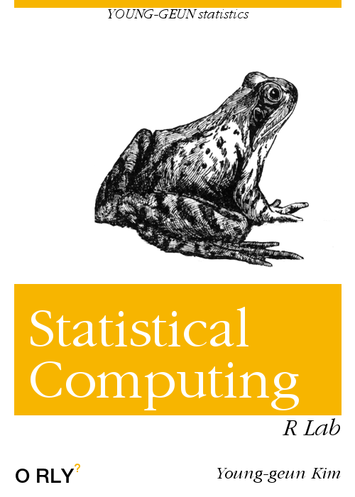

--- 
title: "R Lab for Statistical Computing"
author: |
  | Young-geun Kim
  | Department of Statistics, SKKU
  | \href{mailto: dudrms33@g.skku.edu}{dudrms33@g.skku.edu}
date: "`r Sys.Date()`"
site: bookdown::bookdown_site
documentclass: book
classoption: openany
bibliography: [book.bib, packages.bib]
biblio-style: apalike
link-citations: yes
description: "This is a lab session for statistical computing."
---

# Welcome {-}

</a> Statistical computing mainly treats useful simulation methods.

## Statistical Computing {-}

We first look at *random generation* methods. Lots of simulation methods are built based on this random numbers.

### Sampling from a fininte population {-}

Generating random numbers is like sampling. From finite population, we can sample data with or without replacement. For example of sampling with replacement, we toss coins 10 times.


```{r}
sample(0:1, size = 10, replace = TRUE)
```

Sampling without replacement: Choose some lottery numbers which consist of 1 to 100.

```{r}
sample(1:100, size = 6, replace = FALSE)
```

### Random generators of common probability distributions {-}

`R` provides some functions which generate random numbers following famous distributions. Although we will learn some skills generating these numbers in basis levels, these functions do the same thing more elegantly.

```{r dbrb, fig.cap="Beta(3,2) random numbers"}
gg_curve(dbeta, from = 0, to = 1, args = list(shape1 = 3, shape2 = 2)) +
  geom_histogram(
    data = tibble(
      rand = rbeta(1000, 3, 2),
      idx = seq(0, 1, length.out = 1000)
    ),
    aes(x = rand, y = ..density..),
    position = "identity",
    bins = 30,
    alpha = .45,
    fill = gg_hcl(1)
  )
```

Figure \@ref(fig:dbrb) shows that `rbeta()` function generate random numbers very well. Histogram is of the random number, and the curve is the true beta distribution.


